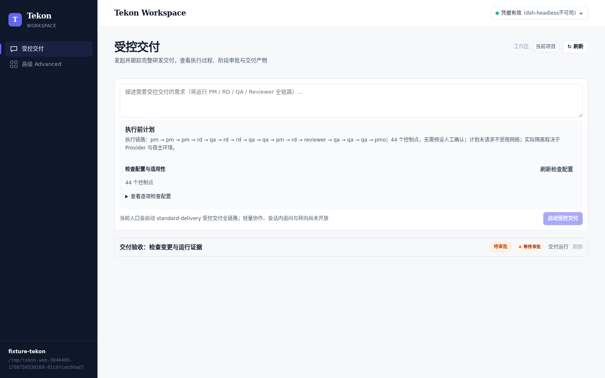
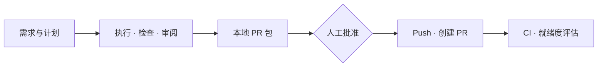

# 天工 Tekon

**把研发需求推进到可审阅的交付。**

本地 Agent workflow 框架：按固定流程分工，在 Git worktree 中执行，汇总代码、检查结果和 PR 材料。需求与风险由人确认，push、创建 PR、合入和上线由人控制。

[用户手册](https://htmlpreview.github.io/?https://github.com/zesming/tekon/blob/main/docs/manual/tekon-user-manual.html) · [产品范围](docs/product/tekon-current-product-scope.md) · [验收证据](docs/reviews/current.md) · [更新记录](CHANGELOG.md)

## 快速开始

需要 Git、npm 和 Node.js（`^20.19.0` 或 `>=22.12.0`）。已测 Node：20.19、22.12、22.19、24.x；未列出的版本不代表已获验证。

```bash
curl -fsSL https://raw.githubusercontent.com/zesming/tekon/main/scripts/install.sh | bash
```

按安装输出配置 PATH，并进入**目标 Git 仓库**。默认 Provider 为 Codex，需要安装 CLI、完成认证并配置可用的 `internal` profile（见[手册 §5.7](docs/manual/tekon-user-manual.md#57-provider)）。

```bash
tekon ui                         # 启动本地 Web，按终端链接进入
# 或直接用 CLI
tekon run "为列表增加筛选条件"
```

使用 Claude Code 时先安装并认证，再执行 `tekon run "你的需求" --agent claude-code`；Web 需在「高级 Advanced → 新建运行」的 Agent 下拉框选择 `claude-code`，默认受控交付入口固定用 Codex。

首次使用时按提示确认初始化（或先运行 `tekon init`）。Web 中先审阅执行计划和检查配置，再点「启动受控交付」；默认运行 `standard-delivery` 完整流程。更新用 `tekon update`。



*Web 实际页面截图，使用验收测试数据。*

## 从需求到交付



| 你要做什么 | 选择的模板 |
| --- | --- |
| 完整研发交付（默认） | `standard-delivery` |
| 开发功能 / 修复缺陷 | `standard-feature` / `bugfix` |
| 补测试 / 改文档 | `test-improvement` / `docs-update` |
| 只做方案 | `plan-only` |

运行通过后仍需检查交付证据。**Run passed 不等于 ready**：PR 准备、PR 创建、远端 CI 等必需证据齐全后，readiness 才可能通过。

## 日常操作

| 操作 | CLI |
| --- | --- |
| 检查仓库命令 | `tekon workflow preflight` |
| 看运行 / 审阅代码与证据 | `tekon status` / `tekon review` |
| 批准等待中的人工 Gate | `tekon resume --approve-human` |
| 生成本地 PR 材料 | `tekon delivery prepare` |
| 批准 push 并创建 PR | `tekon delivery create-pr --approve-human` |
| 等待 CI / 评估交付完整性 | `tekon delivery ci-watch` / `tekon eval readiness` |

多次运行时加 `--run-id <id>` 指定目标。断连后保留原 Request ID 重试；暂停、取消、旧进程退出确认和恢复见[手册 §7.1](docs/manual/tekon-user-manual.md#71-暂停取消与恢复)。完整命令用 `tekon help`。

## 当前边界

| 可用 | 限制 |
| --- | --- |
| 本地 CLI / Web、受控 workflow、结构化产物、检查与审计 | Session 尚不支持连续追问、中途转向或完整模型流式输出 |
| mock、Codex、Claude Code | `dsh-headless` 为实验性 Provider，默认关闭、网络不受限、仅 Goal 可用 |
| 原请求重试、暂停与显式恢复 | 取消为不可恢复终态；Goal 不接交付流程，默认拒绝源码改动 |
| 当前项目与历史运行查看 | 无多 Workspace 管理；`clean` 暂停物理删除 |

适合可回滚、可人工审阅的中小任务。完整权限、执行环境和交付限制见[产品范围](docs/product/tekon-current-product-scope.md)。

## 开发与文档

在 **Tekon 源码仓库**执行：

```bash
npm exec --yes -- pnpm@10.12.1 install --frozen-lockfile
pnpm build
pnpm typecheck
pnpm test --run
pnpm lint
```

后续命令也可用 `npm exec --yes -- pnpm@10.12.1` 代替 `pnpm`。

| 入口 | 内容 |
| --- | --- |
| `packages/core` · `packages/cli` · `packages/web` | 工作流引擎 · 命令行 · Web |
| [用户手册](docs/manual/tekon-user-manual.md) | 操作步骤、命令和故障处理 |
| [运行时合同](docs/technical/tekon-runtime-contract.md) · [Web 设计](docs/design/tekon-run-control-design.md) | 状态、恢复、权限与交互约定 |
| [当前验收](docs/reviews/current.md) | 已验证能力、证据和剩余限制 |
