# Tekon Codex 需求落地流程记录图

日期：2026-06-11

依据：本次 Codex provider 自举闭环日志、`.tekon` 运行库、PR/CI 证据与归档报告。

范围：从用户方向修正、方案收敛、实现修复、真实 Tekon run、真实 PR 创建到归档结论。

结论：本次 P0 目标已落地到真实 PR。成功 run 为 `run_d2350140-b1b7-4fca-b01b-e28daac61e31`，工作流状态 `passed`，8 个 gates 全部通过，PR `https://github.com/zesming/tekon/pull/2` 已创建且远端 CI 通过；未执行 merge、release 或上线。

## 1. 一图总览

```mermaid
flowchart LR
  U0["用户输入：阅读评估报告并判断路线"] --> U1["方向修正：先适配 Codex，不先适配 Trae"]
  U1 --> U2["运行约束：Codex 必须用 codex --profile internal"]
  U2 --> U3["P0 边界：真实样本闭环，从 Tekon 自身需求自举"]
  U3 --> U4["交付边界：只创建真实 PR，不自动合入、不上线"]

  U4 --> S1["调研与方案：确认受控 AI 交付、provider 优先级与后续路线"]
  S1 --> S2["样本选择：补充 codex-provider-smoke artifact 输出目录诊断说明"]
  S2 --> S3["实现准备：补齐 Codex provider、artifact protocol、schema 与 delivery 风险点"]

  S3 --> F0["失败修复侧链"]
  F0 --> F1["401 / internal profile：固定 codex --profile internal"]
  F0 --> F2["artifact 输出不可写：受控追加 --add-dir <TEKON_OUTPUT_DIR>"]
  F0 --> F3["manifest 后继续执行：强化 artifact 完成即停止协议"]
  F0 --> F4["schema drift：兼容归一化 provider 风格字段"]
  F0 --> F5["安全扫描 fixture 误报：测试改运行时拼接"]
  F0 --> F6["worktree finalize 漏洞：只 stage 真实可提交变更"]
  F0 --> F7["RD timeout：manifest 优先，验证交给 Tekon gates"]
  F0 --> F8["create-pr argv 误判：允许 argv 数据字面量中的 <TEKON_OUTPUT_DIR>"]

  F1 --> R0["真实 run 启动：run_d2350140-b1b7-4fca-b01b-e28daac61e31"]
  F2 --> R0
  F3 --> R0
  F4 --> R0
  F5 --> R0
  F6 --> R0
  F7 --> R0
  F8 --> R0

  R0 --> PM["PM：生成 demand-card"]
  PM --> G1["schema gate passed"]
  G1 --> RD["RD：修改 Markdown + HTML smoke 文档"]
  RD --> G2["build / lint / security-scan / schema gates passed"]
  G2 --> QA["QA：验收关键字、占位符、输出目录边界"]
  QA --> G3["test-report schema passed"]
  G3 --> CR["Reviewer：独立审阅，无必须修复项"]
  CR --> G4["review-report schema passed"]
  G4 --> PMO["PMO：生成 delivery-package"]
  PMO --> G5["delivery-package schema passed"]
  G5 --> PASS["workflow passed：5 个角色节点通过，8 gates passed"]

  PASS --> PR0["人工批准 create-pr：--approve-human"]
  PR0 --> PR1["push 分支：tekon-delivery/run_d2350140-b1b7-4fca-b01b-e28daac61e31"]
  PR1 --> PR2["真实 PR：github.com/zesming/tekon/pull/2"]
  PR2 --> CI["远端 CI passed：Core build and tests；Lint GitHub Actions workflows"]
  CI --> DOC["归档报告：docs/reviews/2026-06-10-tekon-codex-self-bootstrap-report.*"]
  DOC --> END["当前边界：PR open；未 merge / release / deploy；readiness 仅剩 AC evidence 映射缺口"]
```

## 2. 落地时间线

| 时间                             | 事件                                                                       | 证据                                                                                    |
| -------------------------------- | -------------------------------------------------------------------------- | --------------------------------------------------------------------------------------- |
| 2026-06-10 14:32:59 UTC          | 成功 run 创建，5 个角色节点进入执行链路                                    | `workflow_instances.status=passed`；`nodes.created_at=2026-06-10T14:32:59.551Z`         |
| 2026-06-10 14:34:20 UTC          | PM 产出 `demand-card.v1.md`，schema gate 通过                              | `.tekon/runs/.../pm-doc-scope/demand-card.v1.md`；PM schema gate passed                 |
| 2026-06-10 14:36:26-14:36:29 UTC | RD 产出 `code-changes.v1.md`，build、lint、security-scan、schema gate 通过 | `.tekon/runs/.../rd-doc-change/code-changes.v1.md`；4 个 RD gates passed                |
| 2026-06-10 14:40:19 UTC          | QA 产出 `test-report.v1.md`，验收文档关键字、占位符与输出目录边界          | `.tekon/runs/.../qa-doc-review/test-report.v1.md`；QA schema gate passed                |
| 2026-06-10 14:43:48 UTC          | Reviewer 产出独立审阅报告，无必须修复项                                    | `.tekon/runs/.../reviewer-doc-review/review-report.v1.md`；reviewer schema gate passed  |
| 2026-06-10 14:46:05 UTC          | PMO 产出 `delivery-package.v1.md`，工作流到达 `passed`                     | `.tekon/runs/.../pmo-delivery/delivery-package.v1.md`；PMO schema gate passed           |
| 2026-06-10 14:47:01 UTC          | CLI 记录人工批准 create-pr，批准范围仅覆盖创建真实 PR                      | `delivery_pull_requests.approved_by=cli`；`approved_at=2026-06-10T14:47:01.505Z`        |
| 2026-06-10 14:47:06 UTC          | delivery 分支推送到 `origin`                                               | `delivery_pull_requests.branch_pushed_at=2026-06-10T14:47:06.319Z`                      |
| 2026-06-10 14:57:28 UTC          | 真实 PR 创建成功，状态 `created`，attempt_count 为 2                       | `delivery_pull_requests.pr_url=https://github.com/zesming/tekon/pull/2`                 |
| 2026-06-10 15:22:07 UTC          | 远端 CI 最终状态 `passed`                                                  | `ci-status.v5.md`：`Core build and tests`、`Lint GitHub Actions workflows` 均为 success |
| 2026-06-10 至 2026-06-11         | 归档并补充完整测试 sweep 证据                                              | `docs/reviews/2026-06-10-tekon-codex-self-bootstrap-report.*`；当前提交 `93c256b`       |

## 3. 角色泳道

| 泳道                | 输入                                       | 动作                                                               | 输出                                     | Gate                                      |
| ------------------- | ------------------------------------------ | ------------------------------------------------------------------ | ---------------------------------------- | ----------------------------------------- |
| 用户 / 产品约束     | 评估报告、路线修正、P0 边界                | 明确 Codex 优先、`codex --profile internal`、Tekon 自举、只创建 PR | 可执行的 P0 验证目标                     | 人工边界：不合入、不上线                  |
| Tekon 编排层        | 真实需求与工作流模板                       | 创建 run、分配角色节点、维护 artifact/gate/audit                   | `docs-update` run                        | 编排层确定性调度，不由 LLM 决策流程       |
| PM                  | 用户需求                                   | 生成结构化 demand-card、验收标准、范围边界                         | `demand-card.v1.md`                      | schema passed                             |
| RD / Codex provider | demand-card、仓库上下文、artifact protocol | 用 `codex --profile internal` 修改 smoke Markdown 与 HTML          | `code-changes.v1.md` 与文档改动          | build、lint、security-scan、schema passed |
| QA                  | RD 改动与验收标准                          | 检查关键字、占位符、HTML 同步、输出目录边界                        | `test-report.v1.md`                      | schema passed                             |
| Reviewer            | RD 与 QA 证据                              | 独立审阅需求满足度与风险                                           | `review-report.v1.md`，无必须修复项      | schema passed                             |
| PMO / Delivery      | 全部 artifact 与 gates                     | 生成 PR 包、记录审批、push 分支、创建 PR、轮询 CI                  | `delivery-package`、`ci-status`、真实 PR | schema passed；远端 CI passed             |
| 归档 / 复盘         | run、PR、CI、测试 sweep                    | 写入正式评估报告与本流程图                                         | 可提交审阅证据                           | 本文档验证                                |

## 4. 失败修复侧链

| 风险点            | 日志现象                                                | 根因判断                                                                        | 落地处理                                                                          | 对本次流程的影响                      |
| ----------------- | ------------------------------------------------------- | ------------------------------------------------------------------------------- | --------------------------------------------------------------------------------- | ------------------------------------- |
| Codex 认证        | `401`                                                   | internal profile 未生效或凭据未进入 provider                                    | 固定 Codex provider 启动命令为 `codex --profile internal`                         | 使真实 provider 可启动                |
| artifact 输出目录 | Codex sandbox 无法写主仓库 `.tekon/runs/...`            | 输出目录未进入 Codex 可写范围                                                   | adapter 在 `exec` 前受控追加 `--add-dir <TEKON_OUTPUT_DIR>`                       | 使 provider 能写 artifact 与 manifest |
| provider 协议     | 写 manifest 后继续做无关动作                            | prompt 对完成边界约束不足                                                       | 强化 artifact/manifest 完成即停止；禁止节点内 subagent、git push 等动作           | 使节点输出可控                        |
| artifact schema   | `code-changes`、`demand-card` 字段漂移                  | 真实模型输出 provider-style 字段                                                | 增加归一化和兼容字段，同时保留 schema 边界                                        | 提升真实模型输出容错                  |
| 安全扫描          | 测试 fixture 假 key 被 scanner 命中                     | 静态测试字符串过像真实密钥                                                      | fixture 改运行时拼接，不削弱生产扫描                                              | 保持 security gate 有效               |
| worktree finalize | ignored `.tekon` 被 `git add .` 拖入                    | finalize stage 范围过宽                                                         | 解析 `git status --porcelain=v1 -z`，只 stage 真实可提交变更                      | 避免运行态污染 PR                     |
| RD timeout        | RD 先 TDD/安装依赖，未先写 manifest                     | TDD 技能顺序与 provider artifact protocol 冲突                                  | 对 RD/code-changes 节点增加 manifest 优先约束，验证交给 Tekon gates               | 降低节点超时和失联概率                |
| PR 创建           | `shell metacharacters are not allowed in argv commands` | CommandGateway 把 PR title/body 中的 `<TEKON_OUTPUT_DIR>` 误判为 shell 控制语法 | 保持 `spawn(..., shell:false)`，仅拒绝独立 shell 控制 token，允许 argv 数据字面量 | create-pr 第二次尝试成功              |

## 5. 最终状态与边界

| 项目          | 状态                                                                                                   |
| ------------- | ------------------------------------------------------------------------------------------------------ |
| 成功 run      | `run_d2350140-b1b7-4fca-b01b-e28daac61e31`                                                             |
| Workflow      | `docs-update`                                                                                          |
| Provider      | Codex，启动方式固定为 `codex --profile internal`                                                       |
| 工作流状态    | `passed`                                                                                               |
| Gates         | 8 passed，0 failed                                                                                     |
| Artifacts     | 14 条记录，其中包括 demand-card、code-changes、test-report、review-report、delivery-package、ci-status |
| PR            | `https://github.com/zesming/tekon/pull/2`                                                              |
| PR 分支       | `tekon-delivery/run_d2350140-b1b7-4fca-b01b-e28daac61e31`                                              |
| 当前本地分支  | `tekon-delivery/evaluation-report`                                                                     |
| 当前本地 HEAD | `93c256b docs: record full test sweep in Codex report`                                                 |
| 远端 CI       | `Core build and tests` passed；`Lint GitHub Actions workflows` passed                                  |
| Readiness     | `score=0.90`，`ready=false`，剩余缺口为 `acceptance-criteria-evidenced` 结构化映射不足                 |
| 人工边界      | PR 保持 open；未 merge、未 release、未 deploy；未执行 force push                                       |

## 6. 判断

事实：这次需求已经从用户约束、方案收敛、Codex provider 修复、真实 Tekon run、gate 验收、PR 创建、远端 CI 到归档报告形成闭环。

推断：P0 的核心目标是验证“真实 provider 到真实 PR”的最小闭环，当前证据已经覆盖该目标；`readiness` 的 AC evidence 映射缺口属于后续证据产品化能力，不构成本次 P0 阻断。

建议：保持 PR open 等待人工审阅。下一阶段优先补强 AC evidence 自动映射、PR 包可读性和 provider 失败样本回归集。
