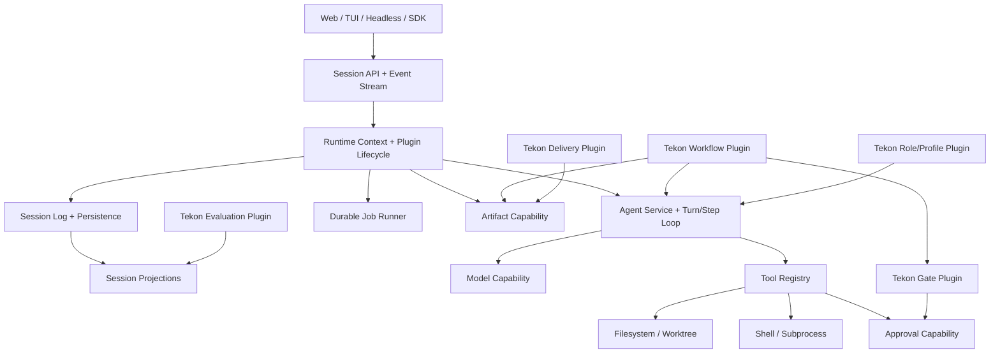

# Tekon 人类可用性审查与 DeepSeek Harness 模式迁移评估

> 审查日期：2026-08-20  
> 审查基线：`main@df38520c5a990d067de38d107e9ded63835a83f8`  
> 审查范围：`packages/core`、`packages/cli`、`packages/web`、数据库模型、运行时、Workflow/Gate/Delivery、现有技术方案与历史评审、近期 PR，以及 DeepSeek Harness 官方仓库和架构文档。  
> 审查方式：静态代码审查、数据流追踪、交互链路复盘、历史 PR/文档交叉验证、外部框架对照。当前执行环境无法可靠下载完整仓库并安装依赖，因此本报告不声称重新跑通本地构建、单测或 E2E；运行结论以代码事实、仓库现有 CI 配置和历史验证记录为依据。

## 0. 维护方决策批注（2026-08-20 复核后追加）

> 本节由维护方在独立复核本报告后追加，用于记录报告的采信程度与处置决策，避免将报告主张误当已批准路线。批注不修改下文正文。

### 0.1 事实核验结论

对本报告的代码级断言逐条做了独立静态核查（含 `file:line` 定位）：P0-01~04、P1 系列共 16 条代码/UI 断言**全部属实、无幻觉、列举精确**。外部对照部分（DeepSeek Harness 真实存在、§7 架构对照、§8.3 事件词汇、引用链接、developer preview 兼容性风险）亦全部核实无误。**报告事实基础扎实，具备作为执行依据的可信度。**

### 0.2 定位判断

报告对代码事实的描述为真，但部分结论存在"以 human-first 对话式工作台标准要求一个当前定位为『审阅驾驶舱（Cockpit/Dashboard）』的 Web"的拔高：如六页签、展示内部 ID、只暴露遥测不暴露原始输出、暴露 timeout 参数等，多为 `docs/technical/tekon-web-architecture.md` §3.2/§3.3/§9/§16 **明确记录的 MVP 取舍或非目标**，被报告重新定性为"根因缺陷/上线阻断"。"是否将 human-first 定为默认产品形态"属产品定位决策。**维护方决策：采纳报告推荐路线，按 Harness-inspired replatform 方向推进**（见 0.3）。

### 0.3 处置决策

- **已采纳并推进**：报告 §12 立即修复清单（P0×6 + P1×8）与 §10 六阶段迁移方向，均纳入执行。落地方案见 `docs/superpowers/plans/2026-08-20-harness-replatform-execution-plan.md`。
- **执行纪律**：严格遵守报告 §10/§11 自身约束——分阶段、每阶段可运行、旧引擎不删除、新旧双轨并存、golden journey 驱动，防止"范围失控→半成品"。治理硬门禁（Gate/人工审批/PR 批准/audit）语义在迁移中不得退化；autonomous 自举链路持续可用。
- **Harness 接入**：仅经稳定公开边界选择性接入（报告 §7.2/§14），不绑定其 developer-preview 私有 schema。
- **P0-03 定级修正**：审批绕过属**治理/授权正确性缺陷**（`run` 需 session token、Web 默认绑 `127.0.0.1`，非远程可利用漏洞），但因其破坏"未批准需求不得运行"这一产品核心承诺、且修复成本极低，仍列为最优先必修项。

### 0.4 工程视角批注（2026-08-21 追加，全量落地依据）

维护方决定按报告全量方向推进 replatform，落地以本节判断为准，覆盖/细化下文正文中过于激进或与工程现实冲突之处：

- **分阶段是纪律不是打折**：报告 §10 的六阶段一次做完既不可验收也违背报告 §11「每阶段可运行、防范围失控」。落地按阶段推进，每阶段独立走"设计→评审→实现→e2e→code review→验收→提交"闭环，旧引擎与新链路双轨并存，任一阶段验收不过即停在该阶段。
- **既有测试债先还**：实测发现 PR 分支基线本身带 flaky/过时测试（CLI `process.chdir` 级联 + 超时过紧、Web e2e 断言停留在英文 UI、Playwright 浏览器版本缺失）。这些与迁移无关，但阻断"全绿"验收，故在阶段 0 先修稳，作为 CI 纳入 CLI/Web/Playwright 的前置。
- **治理语义零退化是硬约束**：无论 UI 如何对话化，Gate/人工审批/PR 人工批准/audit 哈希链的语义在迁移中不得削弱；`inline 展示 ≠ 取消规则`；未批准 shaped demand 不得经任何路径运行。human-first 为默认交互，但 autonomous/headless 自举链路必须持续可用。
- **Harness 只做参考架构 + 稳定边界接入**：官方 developer preview 明确警告 breaking changes，不把 Tekon 持久化模型与领域对象绑定其私有 schema；Cordis 可先用轻量 Context/Plugin 契约,不在首阶段全量引入。
- **每阶段落地明细与验收证据**：见 `docs/superpowers/plans/2026-08-20-harness-replatform-execution-plan.md`，该方案已过一轮评审 + 维护方自检；各阶段完成后在 `CHANGELOG.md` 记录版本与验证结果。
- **P1.3/P1.4 等"纯 UI"项实际触达 API 契约**：Run 列表需求标题、Run Detail 真实 provider 需要在 mapper/schema 层补字段（`demandTitle`/`provider`，nullable 向后兼容），已在阶段 0 落地并配 contract/enrichment 测试。

### 0.5 工程视角批注（2026-08-24 追加，阶段 2–5 落地依据）

阶段 0+1 已交付并合入证据链（v0.9.0，PR #10，CI 六项全绿）。以下批注针对**剩余阶段 2–5**，基于对当前代码的实测摸底（非报告推断），沿用 §0.4 的"分阶段是纪律不是打折"原则，覆盖/细化下文正文与 §10 阶段划分中与工程现实冲突之处：

- **阶段 2 契约已冻结，风险纯在实现**：`AgentDriver`/`AgentHandle`/`AgentRuntimeEvent`/`UserMessage`/`AgentOutcome`/`PauseResult` 已在 `packages/core/src/types/session-contract.ts:185-266` 冻结导出，**零实现者**。故阶段 2 = 对既定契约做实现 + legacy `runAgent()` 桥接，不需要再设计接口。最大实现难点是 `AgentHandle.pause()` 语义：当前 engine 只在 node 边界响应 pause（`engine.ts:382`），从不中断执行中的 subprocess——mid-step pause 的 `interruptible` 需诚实反映"当前工具不可中断则返回 interruptible:false，在下一个 checkpoint 生效"，不假装能瞬停。
- **事件词汇 12 缺 7，且模型可见历史近乎为空**：核心 12 类事件只发射了 5 类（`step/*`、`assistant/chunk`、`tool/*`、`plan/updated`、`todo/updated` 全缺）；`assistant/message` 目前是合成的 "Run passed."、`user/message` 仅为需求文本，`buildModelVisibleView`（`present.ts:88`）无消费者。阶段 2 的 §13.6"模型上下文可从 log 重建"是从极低基线起步，须把真实 assistant/tool 内容写入事件流才有意义——这是阶段 2 的核心价值，不是附带项。
- **legacy 桥接是阶段 2 的安全底座，先于流式**：`node-executor.ts:235` 每 node 一次 `await adapter.runAgent()`。先把"一次旧调用 = 一个 step（emit step/start + tool/call 摘要 + tool/result + step/end + assistant/message）"桥好，既立刻补齐事件词汇、又不必重写 Codex/Claude adapter；真正的增量流式（assistant/chunk 逐块）作为桥接之上的可选增强，Codex/Claude 是否支持增量输出需先验证 provider 能力，不能假设。
- **provider 已有 registry 范式可复用**：gate 侧 `gate/registry.ts` 是仓内已验证的插件边界；provider 目前是 `agent-runtime.ts:60-164` 两处重复 if/else。阶段 2 的 provider registry 化应照搬 gate registry 模式，而非新造抽象。provider snapshot/version contract 是 greenfield（当前只有 zod 校验、无版本 pin），须新增版本兼容矩阵防升级静默破坏 replay。
- **阶段 3 客户端完全没有会话读路径**：客户端无 SSE 消费者、无 `session.*` RPC，全部页面从 legacy 表聚合（`review.get`）渲染；`use-run-poller.ts` 是死代码。阶段 3 不是"加个 feed 组件"，而要新建：① SSE 客户端（EventSource + 断线重连 + Last-Event-ID replay，服务端已支持）；② session list/detail 读投影或 RPC；③ 三栏 Session UI。工作量与阶段 1 相当或更大，须再拆子步（如 3a 读路径/SSE 客户端、3b Feed/Composer、3c inline approval/cards、3d 断线重连+旧 Dashboard 移 `/advanced`），每子步独立 e2e。旧 Dashboard **保留**移到 `/advanced`，不删（C2）。
- **阶段 4 CLI 接入 Session 是重活,不是"共享构造器"**：CLI 目前完全在 event spine 之外——无 session、无 dual-write、无 job、同步阻塞跑到底（`run.ts:155`）。P1-05 的"CLI/Web/Headless 同一 Session API"需要给 CLI 建 headless session/job 模式（或改走同一 runner），是实质迁移。profiles 除 `sessions.profile` 列存在外全 greenfield。delivery 已与 engine 解耦，只需事件订阅接线；gate 已有 registry。故阶段 4 真正的重量在 workflow 降级为可选 plugin + CLI 会话化两项。
- **阶段 5 只碰稳定边界,legacy 清理可独立先行**：Harness/Cordis 当前零集成，阶段 5 的 bridge 是 greenfield，须 pin 版本 + adapter contract test + anti-corruption layer，**绝不绑定其 developer-preview 私有 schema**（§7.2）。但 legacy 清理（死代码 `use-run-poller.ts`、deprecated `demand.*` 别名层、`job/status` 词汇归位）与定位无关、价值即时、风险低，可在任一阶段顺带清理，不必等到阶段 5。长 RPC 已在阶段 1 基本退场。
- **锯齿状智能与 March of Nines 自省**：阶段 2–5 每一项都可能"能 demo 不能生产"。落地必须以真实 e2e（含尾部失败、断线、取消、并发）为验收，不以"页面能点"为准；任一阶段验收不过即停在该阶段，宁可少交付也不留半成品。每阶段完成后照旧走"设计→reviewer 评审→实现（e2e 绿）→code review→全功能 e2e→报告完成度复审→提交 PR + 清理临时产物"闭环。

### 1.1 总体结论

Tekon 当前已经具备一套相对完整的 **Agent 自动交付治理底盘**：角色、Workflow、Node、Gate、Artifact、Worktree、审计、人工审批和 PR 交付都已经形成可组合链路。对于“Agent 自举”“按模板推进”“用硬门禁约束自动交付”这一目标，现有方向是成立的。

但对于“人直接使用”，当前版本仍可判定为 **基本不可用，不具备普通用户发布条件**。问题不是页面样式不够精致，而是产品与架构的主抽象都围绕机器执行设计：

- 系统的中心对象是 `workflow / node / gate / artifact / role-run`；
- 人的自然心智模型却是 `workspace / session / message / plan / action / result`；
- 当前输入被拆散在 Demand、Draft、Run 参数和配置中；
- 当前输出被拆散在 Overview、Artifacts、Gates、Audit、Delivery、Progress 六个页签中；
- Agent 的实时思考、文本输出、工具调用、文件变化和可干预点没有形成一条连续叙事；
- 暂停、取消、恢复、审批等控制并未都对应真实运行时能力。

因此，用户提出的“按 DeepSeek Harness 的框架模式迁移改造”是 **合理且有必要的**。不过不建议把 Tekon 直接重写成 DeepSeek Harness 内部实现的下游壳，也不建议把 Tekon 的 Workflow/Gate/Artifact 体系整体丢弃。

**推荐决策：采用 DeepSeek Harness 的架构模式进行分层重构，保留 Tekon 的治理能力，并通过稳定适配层选择性接入 Harness。**

更具体地说：

1. 用 `Workspace → Session → Turn → Step → Event` 取代 Workflow Run 作为人机交互主轴；
2. 用追加式、可回放的 typed session event log 作为交互事实源；
3. 用流式 Agent Loop 取代当前 node 级一次性 `runAgent()`；
4. 把 model、tools、filesystem、shell、sandbox、approval、artifact、workflow、gate、delivery 做成能力缝隙或插件；
5. 把现有 Workflow/Gate/Delivery 降为“治理插件与投影”，而不是所有交互都必须穿过的唯一入口；
6. Web 默认变为对话式工作台，Cockpit 保留为高级治理视图；
7. Headless/自举模式继续存在，并通过 profile/bundle 组合获得高自治能力。

### 1.2 评估评分

| 维度 | 当前评分 | 说明 |
| --- | ---: | --- |
| Agent 自动执行底盘 | 7.5/10 | Workflow、Gate、Artifact、Worktree、Delivery 具备较完整骨架 |
| 确定性治理与审计 | 8/10 | 硬门禁、证据、哈希审计和显式 PR 审批是可保留资产 |
| 架构可扩展性 | 4/10 | 局部已有 registry，但 Agent provider、运行时和数据模型仍由核心集中控制 |
| 人类任务输入体验 | 2/10 | 用户需要理解模板、Agent、毫秒超时、脏工作区等实现细节 |
| 运行过程可见性 | 1.5/10 | 无会话流、无模型流、无工具调用流；Progress 主要展示遥测元数据 |
| 人类可干预性 | 2/10 | 缺少 steer/follow-up；暂停/取消未形成真实中断链路 |
| 输出可读性 | 2/10 | 结果分散在多个后端实体页签，Run 列表甚至主要展示 ID |
| Web 发布信心 | 3/10 | Web/CLI 不在当前主 CI 中，且存在若干 P0/P1 语义问题 |
| Harness 模式适配度 | 8.5/10 | Session/Event/Plugin/Capability/Profile 与当前缺口高度匹配 |
| 直接依赖 Harness 内部 API | 4/10 | 官方明确处于 developer preview，存在破坏性兼容变更风险 |
| 分阶段模式迁移可行性 | 8/10 | 可通过双写事件、兼容适配器和新旧 UI 并存逐步迁移 |

## 2. 当前产品为什么“Agent 能用，人不能用”

Tekon V2 技术方案明确提出“**产物驱动而非聊天驱动**”，并把它作为架构原则。这个原则对于 Agent 之间的结构化交接、审计和确定性交付是有价值的，但它被延伸成了整个产品的唯一交互范式。

当前实现隐含的用户路径是：

```text
输入原始需求
  → 单独进入需求澄清
  → 查看结构化 Demand Shape
  → 单独批准需求
  → 跳转 Runs
  → 选择 Workflow 模板 / Agent / 超时 / 脏工作区
  → 发起 Run
  → 在多个页面和页签中追踪状态
  → 去审批队列处理 Gate
  → 去 Delivery 准备和创建 PR
```

这条链路适合熟悉 Tekon 内部对象的系统操作者，不适合只想“描述任务、看懂过程、必要时纠偏、拿到结果”的普通用户。

更合适的原则应调整为：

> **对话负责理解、协作与干预；产物负责结构化交付；事件负责持久化、回放与审计；Workflow/Gate 负责治理。**

这不是把 Tekon 变成一个普通聊天机器人。相反，它要求把治理能力嵌入会话，而不是让用户先学会治理数据模型。

## 3. 上线阻断问题

### P0-01：Web“发起运行”是长时间阻塞的 HTTP 请求

相关代码：

- [`packages/web/src/server/api/routers/project.ts`](../../packages/web/src/server/api/routers/project.ts)
- [`packages/core/src/workflow/engine.ts`](../../packages/core/src/workflow/engine.ts)
- [`packages/web/src/client/components/runs/StartRunForm.tsx`](../../packages/web/src/client/components/runs/StartRunForm.tsx)

`project.run` 在 HTTP/RPC handler 中直接：

```ts
const result = await engine.startRun(...)
```

而 `startRun()` 会继续执行完整 plan，直到通过、阻塞或中断后才返回。前端只有 RPC 返回后才能拿到 `result.run.id`，成功提示“运行已启动”实际上可能发生在整段 Workflow 已经执行完之后。

直接影响：

- 按钮会长时间停留在“启动中”；
- 创建任务与执行任务没有解耦；
- 用户无法立即进入该 Run/Session；
- 浏览器断连、代理超时或服务重启时缺少明确的 job ownership；
- 实时状态、取消、恢复和后台执行都很难做正确；
- 长任务被错误建模成 request/response，而不是 durable background job。

**建议：** `POST session/start` 或 `POST job/start` 只负责持久化 Session/Job 并立即返回；独立 Job Runner 异步驱动 Agent Loop，通过 SSE/WebSocket/事件订阅持续推送结果。

### P0-02：暂停与取消目前主要是“改数据库状态”，不是中断执行

相关代码：

- [`packages/web/src/server/api/routers/project.ts`](../../packages/web/src/server/api/routers/project.ts)
- [`packages/web/src/client/components/runs/RunControls.tsx`](../../packages/web/src/client/components/runs/RunControls.tsx)
- [`packages/core/src/runtime/agent-adapter.ts`](../../packages/core/src/runtime/agent-adapter.ts)
- [`packages/core/src/workflow/engine.ts`](../../packages/core/src/workflow/engine.ts)

`pause` 和 `cancel` endpoint 只是调用 `updateWorkflowInstanceStatus()`。当前 `AgentRunInput` 没有 `AbortSignal` 或 cancellation token；Workflow 执行循环也没有在每个 step/node/gate 前读取取消状态；正在运行的 Claude Code/Codex 子进程不会因为数据库状态改变而停止。

可能出现：

- UI 显示 paused/cancelled，但子进程继续写文件和产生产物；
- 引擎后续状态更新覆盖用户刚写入的 cancelled；
- 用户误以为危险操作已经停止；
- 恢复时遇到仍在执行或状态不一致的 RoleRun/Worktree。

**建议：** 运行时必须持有可定位的 Job/Process handle；取消需要沿 `Session → Agent → Tool/Subprocess` 传播 AbortSignal；暂停需要在安全 checkpoint 停止领取下一 step，并明确“当前工具是否可中断”。

### P0-03：Web 可绕过“需求未批准不得运行”的治理规则

相关代码：

- [`packages/web/src/client/components/demand/DraftCard.tsx`](../../packages/web/src/client/components/demand/DraftCard.tsx)
- [`packages/web/src/client/components/runs/StartRunForm.tsx`](../../packages/web/src/client/components/runs/StartRunForm.tsx)
- [`packages/web/src/server/api/routers/project.ts`](../../packages/web/src/server/api/routers/project.ts)

完整路径如下：

1. `DraftCard` 无论是否 `approved` 或 `readyForRun`，都显示“使用此需求发起运行”；
2. 页面只把 `shapePath` 放进 URL；
3. `StartRunForm` 用该路径读取详情并回填 `demandText` 和模板；
4. 真正调用 `project.run` 时只发送纯文本，没有发送 `demandShapePath`；
5. 服务端只在 `demandShapePath` 存在时检查 `shapedDraft.approved`。

因此未批准的结构化需求会退化成普通 `demandText`，绕过服务端审批校验。

**立即修复：**

- `StartRunForm` 传递 `demandShapePath: shapePath`；
- 未批准或 `readyForRun=false` 时禁用启动按钮；
- 服务端为 shaped demand 建立不可绕过的 ID/引用，而不是把“是否走审批”交给客户端可选字段；
- 增加 Web API 与 E2E 回归测试。

### P0-04：当前运行时契约无法支持人类可读的实时输入输出

相关代码：

- [`packages/core/src/runtime/agent-adapter.ts`](../../packages/core/src/runtime/agent-adapter.ts)
- [`packages/core/src/workflow/node-executor.ts`](../../packages/core/src/workflow/node-executor.ts)
- [`packages/web/src/client/pages/run-detail/ProgressTab.tsx`](../../packages/web/src/client/pages/run-detail/ProgressTab.tsx)

当前 AgentAdapter 的中心接口是一次性：

```ts
runAgent(input): Promise<AgentRunResult>
```

它接收完整 prompt，在 node 结束后返回 exit code、耗时、输出文件和 artifact。接口中没有：

- user/assistant message；
- assistant chunk；
- turn/step；
- tool call/result；
- reasoning/summary；
- follow-up/steer/inject；
- pause/cancel signal；
- 流式事件订阅。

Progress 页明确声明 raw stdout/stderr 永不暴露，页面主要展示 command、字节数、心跳、文件数和超时风险。这些数据适合运维诊断，却无法回答用户最基本的四个问题：

1. Agent 现在在做什么？
2. 为什么这样做？
3. 刚刚输出了什么？
4. 我现在能否补充或纠正？

**建议：** 新建流式 `AgentDriver`/`AgentLoop` 契约，返回 typed events；旧 `runAgent()` 只作为 legacy adapter 包装成一个不可细分 step。

## 4. 主要架构问题

### P1-01：缺少 Session/Turn/Step/Message 数据模型

当前 SQLite 表包括 Demand、Project、Workflow、Phase、Node、Artifact、RoleRun、Gate、HumanDecision、Audit、Worktree、Delivery 和 Provider Config，但没有：

- workspace；
- session；
- session event；
- turn；
- step；
- user/assistant message；
- tool call/result；
- job；
- event projection/checkpoint。

相关代码：[`packages/core/src/db/migrations.ts`](../../packages/core/src/db/migrations.ts)

`audit_events` 是通用 JSON 审计记录，不等于模型会话事实源：

- 模型上下文不是从 audit log 派生；
- 原始流式 chunk、tool call/result 没有稳定类型；
- replay 无法严格重建一次模型请求；
- UI 与模型看到的内容不是同一份 canonical history；
- 新插件扩展事件时缺少版本和兼容策略。

### P1-02：Workflow Engine 是特权核心，扩展点不统一

当前核心已经做了若干良好拆分，但仍存在：

- Agent provider 通过 `if/else` 选择 `mock / claude-code / codex`；
- provider snapshot restore 也重复同一分支；
- 添加 provider 需要修改 core factory；
- gate 虽已有 registry，其他 subsystem 没有统一 capability lifecycle；
- Gate Runner 与 Rework 之间通过 lazy cross-reference 处理循环依赖；
- Workflow Engine 同时承担实例化、状态、执行、恢复和跨模块协调。

相关代码：

- [`packages/core/src/runtime/agent-runtime.ts`](../../packages/core/src/runtime/agent-runtime.ts)
- [`packages/core/src/workflow/engine.ts`](../../packages/core/src/workflow/engine.ts)

这说明局部模块化已经接近现有中心式架构的边界。继续往 engine 中加 session、stream、subagent、workspace、tool cards 和 UI state，会让核心进一步膨胀。

### P1-03：Project 并非稳定 Workspace，而是每次 Run 新建

`engine.startRun()` 每次都会创建新的 `Project` 和新的 `Demand`，Project 名还固定为 `tekon`。这使 `Project` 更像一次执行的附属记录，而不是用户可持续选择、配置、搜索和恢复的工作空间。

迁移后应明确：

```text
Workspace（稳定 repo / 路径 / 权限 / 配置）
  └─ Session（一个持续的人机任务）
       ├─ Turn / Step / Event
       ├─ 可选 Goal / WorkflowInstance
       ├─ Artifact / Approval / Delivery
       └─ Job / Subagent
```

### P1-04：状态修改缺少统一状态机与原子边界

问题包括：

- Web 的 pause/cancel 直接写 Workflow status，未通过统一 transition validator；
- `resumeRun()` 在 terminal status 分支返回带 `error` 的对象，再强制 cast 成 `WorkflowEngineResult`，破坏类型契约；
- RoleRun repository 只有 `markRoleRunCompleted()`，没有对称的 failed/interrupted API；
- Node 执行失败路径会把 node 设为 interrupted，但可能留下 status=running 的 RoleRun；
- Workflow、Node、RoleRun、Worktree、Artifact 的多步更新缺少明确事务边界。

建议把状态变更变为事件提交和 projection，而不是各模块直接写多个状态表。

### P1-05：CLI 与 Web 共享代码，但行为仍可能漂移

已有 shared runtime factory 是积极改进，但 CLI/Web 仍存在不同 approval 默认值、不同入口流程和不同错误呈现。当前以“共享构造函数”实现一致性还不够；迁移后应让两个 surface 订阅同一 Session/Agent API，差异仅体现在 profile、展示和输入方式。

### P1-06：当前 CI 没有覆盖最影响人类可用性的层

[`.github/workflows/core.yml`](../../.github/workflows/core.yml) 目前只执行：

- Actionlint；
- `@tekon/core` build；
- core unit tests；
- core e2e tests。

没有进入主 CI 的包括：

- 根级 typecheck/lint；
- CLI build/unit/e2e；
- Web build/typecheck/unit；
- Playwright；
- 生产静态资源 smoke；
- 浏览器中的长任务、断线重连、取消与审批语义。

历史评审曾在本地跑过 Web 测试并报告通过，但这不等于主分支持续受到保护。迁移前必须把 Web/CLI 契约测试纳入 CI，否则新架构会放大回归风险。

## 5. 功能实现问题

### P1-07：没有真正的任务续聊和运行中转向

当前用户只能：

- 启动一个新 Run；
- 暂停/恢复/取消有限状态；
- 在独立审批页处理 Gate；
- 重新跑或进入下一命令。

用户不能在同一上下文中：

- “先不要改代码，解释一下方案”；
- “你理解错了，目标是 A 不是 B”；
- “把这个文件也纳入范围”；
- “保留刚才结果，尝试另一条路线”；
- “继续处理失败测试”；
- “只重跑这个 tool/step”；
- “基于当前 Session 创建 fork”。

这不是 UI 按钮缺失，而是底层没有 inbox、turn、step 和 message history。

### P1-08：恢复入口与真实可恢复状态不一致

Workflow status 包含 `blocked`、`interrupted`，Engine 也把它们视为可恢复状态；但 `RunControls` 只在 `paused` 时显示 Resume。用户最需要恢复的失败/中断场景反而没有主入口。

### P1-09：实时刷新机制未接入

`use-run-poller.ts` 定义了 3 秒轮询，但仓库中没有实际调用点；通用 `useQuery()` 只在首次加载或 cache invalidation 时抓取数据。

即便未来接入，该 hook 的 terminal status 集合使用 `completed / failed / cancelled`，而 Workflow 的成功状态实际是 `passed`，还遗漏 `blocked / interrupted`。因此当前页面不是可靠的 live view。

### P1-10：输出被当成 Artifact 和遥测，而不是用户结果

Overview 的中心信息是 readiness、failed checks、evidence groups、next CLI commands 和 gate triage；Progress 的中心信息是命令活动元数据；Artifacts、Audit 和 Delivery 各自维护另一个视角。

系统缺少一个 canonical final answer，至少应包含：

- 对原任务的直接回答；
- 做了什么；
- 为什么这样做；
- 改了哪些文件；
- 测试/门禁结果；
- 未解决问题和风险；
- 可执行的下一步按钮。

### P1-11：安全与可见性被错误地处理成“隐藏全部输出”

不暴露未脱敏 raw stdout/stderr 是合理的安全要求，但当前选择是只展示字节数和时间戳。这牺牲了产品可用性。

建议采用分层输出：

1. 默认展示 Agent 的结构化叙事和安全摘要；
2. 工具调用以可折叠 card 展示命令、状态、关键输出；
3. 输出先脱敏、限长和 spill，再通过显式展开查看；
4. 原始大日志作为受控 attachment/artifact，不直接塞进消息流；
5. 所有真正进入模型上下文的 tool result 必须可回放。

## 6. UI 与交互审查

### 6.1 信息架构映射了后端名词，不是用户任务

当前一级导航是：

- Dashboard；
- Runs；
- Approvals；
- Delivery；
- Demand；
- Config；
- Evaluations。

这要求用户先理解 Tekon 的组织结构，再决定去哪完成任务。建议默认一级导航缩减为：

- Workspaces；
- Sessions；
- New Task；

其余 Workflow、Gates、Artifacts、Audit、Delivery、Profiles 进入 Session 内的高级 Inspector 或 Settings。

### 6.2 新建 Run 暴露过多实现参数

`StartRunForm` 首次创建任务就要求用户面对：

- Workflow 模板；
- Agent provider；
- `timeoutMs`；
- `noProgressTimeoutMs`；
- 是否允许脏工作区。

这些应由 profile、workspace policy 和运行时默认值负责。普通用户首屏只需要：

- 工作目录/Workspace；
- 一段任务描述；
- 可选附件；
- 可选“先规划再执行”。

高级参数应放在折叠的 session settings 中，并给出人类单位与风险解释。

### 6.3 Runs 列表几乎不能回答“这是什么任务”

`RunTable` 的主要列是：

- Run ID；
- status；
- `demandId`；
- `currentNodeId`；
- duration；
- created。

Demand 列没有展示需求标题/摘要，而是内部 ID；Progress 列展示 raw node ID。用户看到的是数据库索引，不是任务含义。

迁移后 Session 列表应展示：

- 自动生成或用户编辑的标题；
- 最近一条用户/Agent 摘要；
- 当前动作，如“正在修改 3 个文件”“等待批准 shell 命令”；
- 变更数、测试状态、未读/待处理；
- 最近更新时间。

### 6.4 Run Detail 需要用户自己拼接故事

Run Detail 把信息拆成：

- Overview；
- Artifacts；
- Gates；
- Audit；
- Delivery；
- Progress。

用户需要在六个页签之间手工重建“发生了什么”。Header 还优先展示完整 run ID，Agent 字段通过 `deriveAgent()` 固定返回 `—`，运行时长用最早/最晚 Gate 时间近似。

建议将主区改为按时间排序的 Session Feed；右侧 Inspector 再按 Plan、Changes、Artifacts、Gates、Audit、Delivery 分类投影。

### 6.5 控件存在无效或误导交互

- terminal run 的“眼睛”按钮没有导航行为；在表格内还会阻止行点击，因此点图标本身没有效果；
- Resume 仅对 paused 出现；
- pause/cancel 图标没有说明真实中断边界；
- Cancel 使用三秒内二次点击确认，状态不够明显，也不利于键盘和辅助技术；
- 多处中英文和内部枚举混用；
- “Next Commands”展示 shell 字符串而不是可解释、可确认、可执行的动作按钮。

### 6.6 建议的默认交互

```text
选择 Workspace
  → 输入任务
  → Agent 用一条消息复述理解，并在必要时提 1~3 个关键问题
  → 展示可编辑 Plan / Todo
  → 用户确认高风险边界，而不是确认所有内部对象
  → Agent 流式执行，工具调用折叠展示
  → 需要审批时在原上下文插入 Approval Card
  → 用户可随时补充、纠偏、暂停或取消
  → 输出 Final Result：摘要 + diff + tests + risks + next actions
  → 可选进入高级 Cockpit 查看 Workflow/Gate/Audit/Delivery
```

## 7. DeepSeek Harness 模式对照

本次对照使用 DeepSeek Harness 官方资料：

- [README](https://github.com/deepseek-ai/deepseek-harness/blob/master/README.md)
- [Architecture](https://github.com/deepseek-ai/deepseek-harness/blob/master/docs/architecture.md)
- [Agent lifecycle](https://github.com/deepseek-ai/deepseek-harness/blob/master/docs/agent-lifecycle.md)
- [Session subsystem](https://github.com/deepseek-ai/deepseek-harness/blob/master/docs/subsystems/session.md)
- [Capability seams](https://github.com/deepseek-ai/deepseek-harness/blob/master/docs/capability-seams.md)
- [Web UI guide](https://github.com/deepseek-ai/deepseek-harness/blob/master/docs/user/guide/index.md)
- [App boot / profiles](https://github.com/deepseek-ai/deepseek-harness/blob/master/packages/boot/app-boot/README.md)

### 7.1 高度匹配的设计

#### Everything is a plugin

Harness 用 Cordis Context 组合插件，model、session、agent loop、tools、workspace、approval、storage、projection、jobs、subagents 和 Web surface 都通过 service/capability 组合。Tekon 正需要从“Workflow Engine 调所有模块”演进为“不同 profile 组合不同能力”。

#### Append-only Session Event Log

Harness 把 Session 定义为 typed append-only log，消息历史从 log 派生；`session/event` 提供持久回放事实，`agent/*` 负责实时控制和状态。这个分层正好解决 Tekon 当前 audit、UI、model context 和 runtime state 彼此分离的问题。

#### Turn/Step Agent Loop

Harness 把一次用户输入组织成 turn，把一次模型调用及其工具执行组织成 step，并记录 assistant chunks、assistant message、tool call/result、turn/step boundaries。Tekon 当前一个 Node 只有一次 opaque `runAgent()`，缺少中间层。

#### Capability Seams

Harness 明确区分模型、工具、文件系统、shell、sandbox、approval、workspace、session persistence、projection、jobs、subagent 等能力。Tekon 的 Gate、Worktree、Delivery、Command Policy 很适合变成新的 Tekon-specific capabilities/plugins。

#### Profiles / Bundles

Harness 用 profile/bundle 组合 Web、headless 等产品形态。Tekon 也需要至少三种 profile：

- `human-web`：默认对话、inline approval、低认知负担；
- `autonomous-delivery`：自举/headless、高自治、严格 Gate；
- `review-only`：只读审查、证据与 PR 建议。

### 7.2 不应直接照搬的部分

DeepSeek Harness 官方 README 明确标注为 **developer preview**，并警告会有兼容性破坏。直接让 Tekon 的持久化模型、核心 domain 和公开 API 绑定 Harness 内部包，会带来：

- 上游 API 高频变化；
- Cordis 与大量 plugin package 的学习和维护成本；
- Tekon 发版节奏被上游牵制；
- Tekon 的确定性 Workflow/Gate 语义被迫适配通用 Agent 语义；
- Debug 范围从一个 monorepo 扩展到复杂插件图；
- 数据迁移需要跟随上游 event/schema 变化。

因此建议把 Harness 当作：

1. **参考架构**；
2. **可选运行时 provider/bridge**；
3. **未来可通过稳定公开边界接入的生态**；

而不是 Tekon 数据库和领域模型的唯一所有者。

## 8. 推荐目标架构

### 8.1 总体结构



### 8.2 核心对象

```text
Workspace
  id, root, repo, branch policy, permission profile, model defaults

Session
  id, workspaceId, title, profile, status, createdAt, updatedAt

SessionEvent
  sessionId, seq, type, version, timestamp, payload,
  visibility, modelVisible, sourceEventSeqs, correlationId

Job
  id, sessionId, kind, status, owner, lease, abortState, checkpoint

Projection
  transcript, plan, changes, approvals, workflow, gates, artifacts, delivery
```

### 8.3 建议事件词汇

基础会话事件：

```text
session/created
turn/start
turn/end
step/start
step/end
user/message
assistant/chunk
assistant/message
agent/status
agent/error
plan/updated
todo/updated
```

工具与控制：

```text
tool/call
tool/result
tool/progress
approval/requested
approval/decided
agent/steered
agent/cancel-requested
agent/cancelled
job/checkpointed
```

Tekon 治理扩展：

```text
workflow/started
workflow/node-started
workflow/node-ended
gate/started
gate/result
artifact/created
artifact/versioned
worktree/leased
worktree/released
delivery/prepared
delivery/pr-created
evaluation/completed
```

所有事件应：

- JSON 可序列化；
- 带显式 schema version；
- 按 Session 单调递增 seq；
- 由 projection 生成 UI，而不是 UI 拼接多个彼此不一致的 endpoint；
- 明确哪些事件进入模型上下文；
- 支持 unknown ignorable event 与 required event 的兼容策略；
- 对大输出使用 attachment/spill reference；
- 对展示层提供统一 redacted presentation。

### 8.4 新 AgentDriver 契约

建议用事件驱动接口替代一次性 Promise：

```ts
interface AgentDriver {
  start(input: AgentStartInput): Promise<AgentHandle>;
  resume(input: AgentResumeInput): Promise<AgentHandle>;
}

interface AgentHandle {
  readonly id: string;
  events(): AsyncIterable<AgentRuntimeEvent>;
  followUp(message: UserMessage): Promise<void>;
  steer(message: UserMessage): Promise<void>;
  pause(): Promise<PauseResult>;
  cancel(reason?: string): Promise<void>;
  whenIdle(): Promise<AgentOutcome>;
}
```

旧 `AgentAdapter.runAgent()` 可以先由 compatibility plugin 包装：一次旧调用映射为一个 step，stdout 只产生受控 progress/summary，最终结果映射为 assistant message + artifacts。这样无需一次性重写 Codex/Claude adapter。

### 8.5 Tekon 现有能力如何保留

| 当前能力 | 迁移后角色 |
| --- | --- |
| Workflow Template | `tekon-workflow` plugin；可由 profile 默认启用，也可由用户在 Session 内开启 |
| Role 文件夹 | Agent preset/persona/skills plugin，不再强制每个任务都暴露角色概念 |
| Gate Engine | `tekon-gate` capability；消费 tool/artifact/workflow events，产出 gate events |
| Artifact Store | Session attachment/artifact capability；保留版本、SHA256 和类型 |
| Worktree Manager | workspace/fs capability 的隔离实现 |
| Command Gateway | shell/tool pre/post policy 与 approval pipeline |
| Audit hash chain | 对 durable session event segment 做哈希或签名投影 |
| Demand Shaping | 首轮 clarification/plan plugin，而不是单独页面和文件跳转 |
| Delivery/PR | Session 内 inline delivery card + `tekon-delivery` plugin |
| Evaluation | session projection/evaluation plugin；高级 Inspector 展示 |

## 9. 推荐 Web 产品形态

### 9.1 页面结构

```text
左侧：Workspace + Session 列表
中间：Session Feed + Composer
右侧：Inspector（可折叠）

Inspector tabs：
- Plan
- Changes
- Artifacts
- Workflow
- Gates
- Audit
- Delivery
```

### 9.2 Feed 节点

- User Message：原始需求、后续补充；
- Understanding Card：Agent 的理解、假设和待确认项；
- Plan Card：可编辑 Todo/Workflow 摘要；
- Assistant Stream：实时回答；
- Tool Card：命令、文件读取、diff、测试，默认折叠；
- Approval Card：风险、影响、命令、允许/拒绝/修改；
- Artifact Card：名称、摘要、版本、打开/比较；
- Gate Card：通过/失败、关键证据、修复动作；
- Final Result：结论、变更、测试、风险、下一步；
- Error/Recovery Card：重试、修改参数、fork、恢复 checkpoint。

### 9.3 默认隐藏的实现细节

普通模式不直接展示：

- raw run ID / demand ID / node ID；
- timeout 毫秒值；
- provider snapshot；
- workflow template ID；
- heartbeat count；
- stdout/stderr byte count；
- gate key；
- worktree lease ID。

这些仍可在 Debug/Audit 面板查看。

## 10. 迁移方案

### 阶段 0：冻结新旧契约，建立 ADR 与验收流

交付：

- 决定采用“模式迁移 + anti-corruption layer”；
- 定义 Session/Event schema v1；
- 定义 AgentDriver、JobRunner、EventSubscription、Projection 接口；
- 固化 5 条 golden journey：新任务、澄清、运行中纠偏、inline approval、失败恢复/PR；
- 为现有 Workflow/Gate/Delivery 建立 contract tests；
- 把 Web/CLI build/typecheck/unit/e2e 纳入 CI。

此阶段不删除旧引擎。

### 阶段 1：先建立 Event Spine 与真实后台 Job

交付：

- 新增 `workspaces`、`sessions`、`session_events`、`jobs`、`projection_checkpoints`；
- `start` API 立即返回 session/job ID；
- 当前 Workflow Engine 在后台 Job Runner 中执行；
- 对现有 node/gate/artifact/audit 做 dual-write event；
- 提供 SSE 或 WebSocket；
- 增加 lease、checkpoint、crash recovery；
- 建立真实 AbortSignal 和 subprocess registry；
- 修复 pause/cancel/status transition。

### 阶段 2：引入流式 Agent Loop 与兼容适配器

交付：

- 新 AgentDriver；
- turn/step/inbox/follow-up/steer；
- assistant chunk/message 与 tool call/result；
- legacy `runAgent()` bridge；
- Codex、Claude Code、Mock 变为 provider plugin；
- provider snapshot/version contract；
- 输出脱敏、限长、spill/attachment；
- all model-visible content replay test。

### 阶段 3：上线 Human-first Session UI

交付：

- Workspace picker；
- Session list；
- composer；
- event feed；
- inline approval；
- tool/diff/artifact/final-result cards；
- 运行中 follow-up/steer/pause/cancel；
- 断线重连和 replay；
- 旧 Dashboard 移到 `/advanced` 或 Session Inspector。

### 阶段 4：Workflow/Gate/Delivery 插件化

交付：

- Workflow Engine 从产品总入口降为可选 goal/governance plugin；
- Gate 订阅 artifact/tool/workflow events；
- Delivery 订阅 readiness/approval events；
- Demand Shaping 变为 clarification/plan flow；
- profiles/bundles：human-web、autonomous-delivery、review-only；
- CLI/Web/Headless 使用同一 Session API。

### 阶段 5：Harness 互操作与旧模型退场

交付：

- 只通过稳定公开边界实现可选 Harness bridge；
- pin 上游版本/commit，建立 adapter contract tests；
- 不把 Tekon DB 绑定到 Harness 私有 schema；
- 对旧 `.tekon` 数据做 read-only projection 或 backfill；
- 删除长 RPC、未使用 poller、旧 factory 和重复 DTO；
- Cockpit 只保留高级审计/运维用途。

## 11. 迁移风险与缓解

| 风险 | 影响 | 缓解 |
| --- | --- | --- |
| Harness developer preview API 变化 | 上游升级破坏 Tekon | 参考模式优先；只依赖稳定边界；pin 版本；anti-corruption layer |
| 双写数据不一致 | Session 与旧表状态冲突 | 单一 event append transaction；projection checksum；对账工具 |
| 事件 schema 膨胀 | 难以兼容和查询 | 事件最小化；version；required/ignorable；projection ownership |
| 人类 UI 稀释硬门禁 | 交互方便但治理退化 | Gate 继续是 capability；inline 展示不等于取消规则 |
| 实时输出泄露敏感信息 | 安全回归 | server-side redaction；spill；权限分层；敏感字段测试 |
| 重构范围失控 | 长期停留在半成品 | golden journey 驱动；每阶段可运行；旧 Cockpit 并存 |
| 取消语义不完整 | 用户误判危险任务已停止 | 明确 interruptibility；process handle；checkpoint；状态确认 |
| Cordis/插件系统复杂度 | 调试与认知成本上升 | 可先实现轻量 Context/Plugin contract；无需首阶段完整引入 Cordis |
| 旧 Workflow 资产丢失 | 自举能力退化 | 以 plugin 包装，保留模板、Role、Gate 和 Artifact 格式 |

## 12. 立即修复清单

即使决定迁移，以下问题也不应等待新架构完成：

### P0

1. 修复 `demandShapePath` 丢失和未批准需求启动；
2. 把 Web run 从长 RPC 拆成后台 job；
3. 实现真实取消，至少能终止当前 provider subprocess；
4. 接入可靠 live update；在事件流完成前可先正确使用 polling；
5. 给用户展示受控、脱敏、可读的 Agent/命令输出；
6. 为上述语义增加 Web E2E。

### P1

1. Resume 覆盖 blocked/interrupted；
2. 修复 terminal “眼睛”按钮；
3. Run 列表展示需求标题和人类状态；
4. Run Detail 展示真实 provider 与准确时间；
5. 修复 RoleRun failed/interrupted 状态；
6. 移除 `as unknown as WorkflowEngineResult` 类型欺骗；
7. 建立 Workflow status transition validator；
8. 主 CI 覆盖 core + CLI + Web + Playwright。

## 13. 验收标准

迁移后的默认 Human profile 至少满足：

1. 首页只需选择 Workspace 并输入一段任务即可开始；
2. start API 快速返回 Session/Job ID，不等待 Agent 完成；
3. 页面无需刷新即可持续看到 assistant、tool、artifact 和 gate 事件；
4. 用户能在运行中 follow-up、steer、pause 和 cancel；
5. cancel 后当前可中断进程真正停止，并产生可验证的终态事件；
6. 所有进入模型上下文的 user/message、assistant/message、tool/result 可从 log 重建；
7. Approval 出现在触发它的上下文中，并清楚解释风险与影响；
8. 未批准 shaped demand 无法通过任何 Web/API 路径运行；
9. Final Result 直接回答原任务，并包含 changes/tests/risks/next actions；
10. 主视图不依赖 raw IDs、Gate key、毫秒参数和字节遥测来表达进度；
11. 旧 Workflow/Gate/Artifact/Delivery 能在 autonomous profile 中继续工作；
12. 断线、刷新和服务重启后可 replay/恢复；
13. CI 覆盖 Core、CLI、Web、事件回放、取消、审批和主要浏览器旅程。

## 14. 最终建议

### 是否应该迁移

**应该。** 当前不可用的根因在运行时契约、数据模型和产品主抽象，而不是局部 UI；继续在现有 Cockpit 上叠加页面和状态会增加复杂度，却不会获得真正的会话、实时输出和人类干预。

### 是否应该直接基于 DeepSeek Harness 全量重写

**不建议直接绑定其内部实现。** 官方仍标注 developer preview，兼容性风险不适合作为 Tekon 的永久基础层。

### 推荐路线

采用 **Harness-inspired replatform**：

- Session/Event/Agent Loop/Capability/Profile 采用 Harness 模式；
- Tekon Workflow/Gate/Artifact/Delivery 作为差异化治理插件；
- 新旧双轨逐步迁移；
- 通过稳定 adapter 选择性接入 Harness；
- Human-first Web 为默认产品，Autonomous/Headless 为 profile，而不是反过来。

这条路线能同时保留 Tekon 已经形成的自动交付资产，并解决当前“Agent 能跑、人看不懂也插不上手”的核心矛盾。
