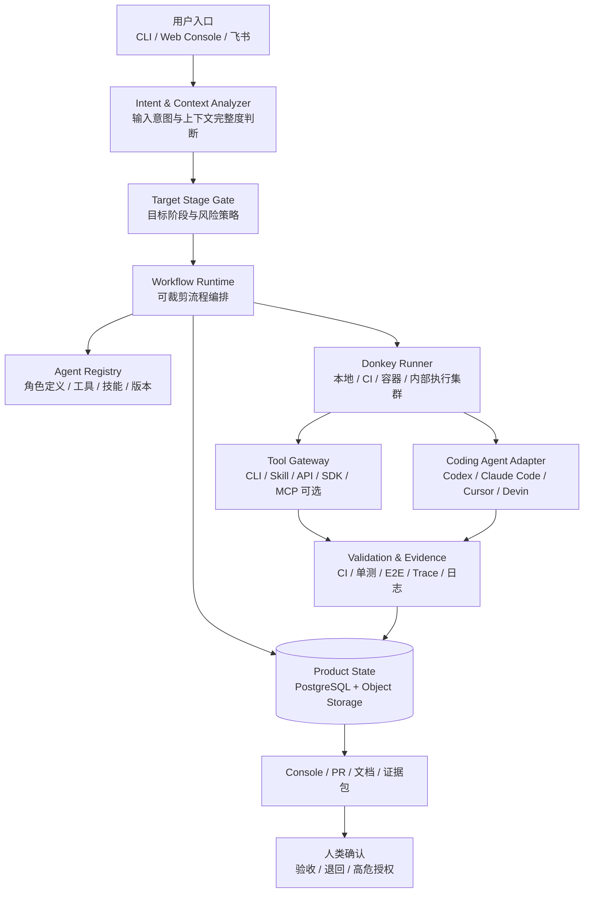
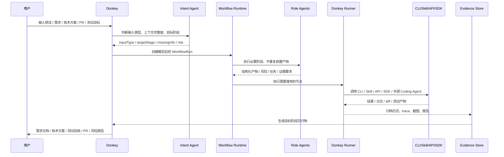

# Donkey MVP 技术方案

## 0. 结论

Donkey MVP 建议定位为“目标阶段驱动的 AI 自动交付运行时”，而不是固定从需求跑到 PR 的单一路径。

核心判断：

- **系统主框架**采用 Donkey Server + Donkey Runner + Donkey CLI + Donkey Console。Server 管状态、策略和审计；Runner 管真实执行；CLI 作为 MVP 低成本入口；Console 用于人审、验收和高危确认。
- **工作流**采用可裁剪 Workflow。系统先判断用户输入的上下文成熟度和目标阶段，再自动推进到最合适的终点，例如需求文档、技术方案、任务拆解、测试验收、PR 或风险报告。
- **工具协作**不优先 MCP。MVP 优先使用 CLI、Skill、Direct API、SDK；MCP 只作为通用外部工具标准化接入的可选路径。
- **角色 Agent**必须通过 Agent Registry 管理自身描述、职责、工具、技能、权限、模型、输出契约和版本，并通过评测数据持续迭代。
- **交付边界**不是“所有需求都到 PR”，而是“所有需求都尽量自动推进到安全且有价值的目标阶段”。涉及生产、高危权限、不可逆操作时，自动推进到方案、清单或风险报告，不自动执行危险动作。
- **Donkey 自身质量**必须从 MVP 开始建设测试、E2E、验收和效果评测体系，否则无法判断 Agent、Workflow 和工具策略是否真的提升交付效率。

推荐 MVP 架构：



---

## 1. MVP 目标与边界

### 1.1 技术目标

Donkey MVP 要支撑 2-3 个相似技术基建仓库，覆盖 B/D 类需求的多种输入形态，并自动推进到合理目标阶段。

阶段口径：

- Phase 1 先做单仓库、多目标阶段闭环。
- Phase 2 验证 2-3 个相似仓库复用，不把系统做成单仓库脚本。
- MVP 成功不只看“是否创建 PR”，还要看“是否按输入成熟度推进到了正确阶段，并提供可验收证据”。

关键能力：

| 能力 | MVP 要求 |
|-|-|
| 意图识别 | 判断用户是从想法开始、已有需求、已有技术方案、已有任务、已有 PR，还是只需要测试验收 |
| 目标阶段选择 | 自动决定推进到需求文档、技术方案、任务拆解、执行开发、测试验收、PR 或风险报告 |
| 上下文完整度检查 | 已有产物不重复生成，只校验缺口并补齐必要信息 |
| 仓库适配 | 每个试点仓库具备 Repo Profile，记录 SOP、测试命令、CI、E2E、风险边界 |
| Workflow Runtime | 可持久化、可恢复、可暂停、可重试、可插入人工确认，支持阶段裁剪 |
| Agent Registry | 角色 Agent 的职责、工具、技能、权限、模型、输出契约和版本可管理 |
| 自动执行 | 通过 Runner 调用 CLI、Skill、API、SDK 和外部 Coding Agent Adapter |
| 自动验证 | 消费 CI、单测、E2E、静态检查结果，生成验收证据 |
| 风险控制 | 高危动作自动降级为方案、清单或人工确认，不自动合入、不自动上线 |
| 效果评测 | 用历史任务 replay 和真实任务指标评估效率、质量、成本和安全 |

### 1.2 非目标

- 不构建通用多租户 Agent 平台。
- 不实现自动上线、自动合入、生产变更自动执行。
- 不自研基础模型或完整 IDE 级代码编辑器。
- 不第一期支持任意技术栈和任意仓库。
- 不把 MCP 作为默认工具协作前提。
- 不把固定全流程作为唯一运行方式。

---

## 2. 行业技术调研摘要

完整调研见 `docs/research/mvp-technical-research.md`。这里只保留对技术方案有直接影响的结论。

### 2.1 Agent 编排与 Dynamic Workflow

| 技术 | 资料 | 可用能力 | Donkey 采用建议 |
|-|-|-|-|
| LangGraph | [官方 workflows/agents 文档](https://docs.langchain.com/oss/python/langgraph/workflows-agents) | workflow、agent、持久化、streaming、debugging、deployment | 可用于角色 Agent 或复杂决策流，不建议作为唯一业务状态源 |
| CrewAI | [官方文档](https://docs.crewai.com/) | crews、flows、guardrails、memory、knowledge、observability | 可借鉴角色化与 Flow 设计，MVP 不强绑定 |
| AutoGen | [官方文档](https://microsoft.github.io/autogen/stable/index.html) | 事件驱动多 Agent、确定性与动态 workflow | 可作为多 Agent 协作参考，产品主干仍需自有状态模型 |
| OpenAI Agents SDK | [官方文档](https://openai.github.io/openai-agents-python/) | tools、handoffs、guardrails、sessions、tracing、sandbox agents | 适合 OpenAI-first agent runtime 或专项 Agent |
| Claude Code Dynamic Workflows | [官方 workflows 文档](https://code.claude.com/docs/en/workflows.md) | 由 Claude 生成 JavaScript orchestration script，runtime 后台编排大量 subagents，适合代码库审计、大迁移、交叉验证和复杂研究 | 借鉴“计划进入代码、结果可复跑”的思想；作为高并发专项节点后端，不作为 Donkey 全局主编排 |

判断：Agent 框架和 Dynamic Workflow 已经能支撑复杂协作，但 Donkey 的核心资产仍是目标阶段、产品状态、仓库画像、风险门禁、证据包、评测数据和审计。外部框架可以替换，Donkey 的运行时对象模型不能被某个框架绑定。

### 2.2 Claude Code 相关能力调研

| 能力 | 资料 | 内容 | 对 Donkey 的判断 |
|-|-|-|-|
| Headless / CLI | [Run Claude Code programmatically](https://code.claude.com/docs/en/headless.md) | 支持 `claude -p` 非交互调用、stdin、JSON 输出、allowedTools、bare mode | 适合作为 Runner 中的最简执行后端之一 |
| Agent SDK | [Agent SDK overview](https://code.claude.com/docs/en/agent-sdk/overview.md) | Python/TypeScript SDK 提供文件读取、命令执行、编辑、subagents、hooks、permissions、sessions | 适合作为可编程 Coding/Role Agent Adapter |
| SDK Hosting | [Hosting the Agent SDK](https://code.claude.com/docs/en/agent-sdk/hosting.md) | SDK 以 `claude` CLI subprocess 运行，涉及工作目录、session transcript、容器隔离、SessionStore、可观测性和多租户隔离 | Donkey Runner 设计需要把 agent session 视为长进程和本地状态，而非无状态 API 调用 |
| Subagents | [Create custom subagents](https://code.claude.com/docs/en/sub-agents.md) | subagent 以 Markdown + YAML frontmatter 定义，包含 description、tools、model、permissionMode、disallowedTools、skills、memory、isolation 等字段；此处为非穷举 | 可作为 Agent Profile 设计参考，但 Donkey 需要抽象到跨后端通用模型 |
| Skills | [Extend Claude with skills](https://code.claude.com/docs/en/skills.md) | Skill 用 `SKILL.md` 封装可复用能力、命令、工具权限、动态上下文和 subagent 执行方式 | Donkey 应把 Skill 作为工具协作优先路径之一，用于沉淀 SOP 和重复流程 |
| Permissions | [Configure permissions](https://code.claude.com/docs/en/agent-sdk/permissions.md) | 支持 permission modes、allow/deny rules、hooks、runtime approval | Donkey 的 Tool Policy 要做成独立层，不能只依赖模型提示词 |

### 2.3 Coding Agent

| 技术 | 资料 | 可用能力 | Donkey 采用建议 |
|-|-|-|-|
| OpenAI Codex | [Codex cloud docs](https://developers.openai.com/codex/cloud) | 后台执行任务、连接 GitHub、创建 PR | 作为 RD Agent Adapter 的优先候选 |
| Claude Code | [Claude Code GitHub Actions](https://code.claude.com/docs/en/github-actions) | 在 issue/PR 中分析代码、创建 PR、实现功能和修复 bug | 适合作为 GitHub 工作流内的代码执行后端 |
| Cursor | [Cursor docs](https://cursor.com/docs) | Agent、Rules、MCP、Skills、CLI、团队能力 | 适合已有 Cursor 使用习惯的团队 |
| Devin | [Devin PR templates](https://docs.devin.ai/integrations/pr-templates) | 独立任务执行与 PR 模板协作 | 适合作为更自动化的外部执行后端 |
| Factory Droids | [Factory Droids](https://factory.ai/product/droids) | 计划、编码、测试、交付代码 | 验证行业趋势：任务级交付正在产品化 |

判断：Donkey 不应在 MVP 阶段复制 Coding Agent 的能力，而应提供统一 Adapter，把“目标阶段、上下文、仓库画像、验收标准、风险边界、证据要求”稳定交给外部执行者，并把执行结果归一成 Donkey 能管理的证据和状态。

### 2.4 持久化工作流

| 技术 | 资料 | 优势 | 风险 |
|-|-|-|-|
| Temporal | [Temporal Workflows](https://docs.temporal.io/workflows) | 成熟、长任务可靠、重试/恢复能力强、适合复杂业务流程 | 引入成本较高，需要理解 workflow/activity 约束 |
| Inngest | [Inngest docs](https://www.inngest.com/docs) | 事件驱动、轻量、开发体验好、支持 TS/Python/Go | 对复杂人工审批和企业内部部署需进一步验证 |
| Hatchet | [Hatchet docs](https://docs.hatchet.run/home) | 面向任务和 agent invocation，支持 durable workflow、replay、监控 | 生态成熟度弱于 Temporal |
| Dagger | [Dagger](https://dagger.io/) | 容器化、可编程交付环境、适合可复现 CI | 更偏执行环境，不是完整业务状态编排 |

推荐：MVP 以“Durable Workflow Abstraction”为系统边界，技术落地优先选 Temporal；如果团队更重视轻量自托管和快速集成，可评估 Hatchet。不要把一次性任务队列或脚本作为最终架构。

### 2.5 工具协作与互操作

| 方式 | 资料或来源 | Donkey 采用建议 |
|-|-|-|
| CLI | 仓库现有命令、内部脚手架、git、CI、测试工具 | MVP 第一优先级，最简单、可观察、容易复用现有 SOP |
| Skill | Claude Code Skills、仓库内自定义 Skill、内部 Skill | 第二优先级，用于沉淀重复流程、审阅清单、测试验收、文档生成 |
| Direct API | 内部平台 API、代码托管 API、CI API、飞书 API | 对稳定系统直连，减少协议层复杂度 |
| SDK | Claude Agent SDK、OpenAI SDK、外部 Coding Agent SDK | 对 Agent 后端使用官方 SDK，便于结构化输出和权限控制 |
| MCP | [MCP security best practices](https://modelcontextprotocol.io/docs/tutorials/security/security_best_practices) | 作为可选标准化工具接入方式，不作为 MVP 默认优先路径 |
| A2A / ACP | [A2A official docs](https://a2a-protocol.org/latest/)、[ACP official docs](https://agentcommunicationprotocol.dev/introduction/welcome) | 保留未来互操作扩展点，不绑定内部对象模型 |

判断：Donkey 的工具层目标是“最短路径稳定完成任务”，不是展示协议完整性。MVP 工具协作优先级应是 CLI > Skill > Direct API > SDK > MCP。

### 2.6 安全、测试与可观测性

| 资料 | 内容 | Donkey 设计影响 |
|-|-|-|
| [OWASP LLM Top 10 2025](https://owasp.org/www-project-top-10-for-large-language-model-applications/assets/PDF/OWASP-Top-10-for-LLMs-v2025.pdf) | LLM 应用存在 prompt injection、敏感信息泄露、供应链等风险 | 仓库内容、文档、需求输入都应视为不可信上下文 |
| [OWASP Agentic AI Threats](https://genai.owasp.org/resource/agentic-ai-threats-and-mitigations/) | Agent 工具使用、自治决策、多 Agent 协作带来新风险 | 高危动作 Gate、工具权限、审计日志是核心能力 |
| [Codex internet access](https://developers.openai.com/codex/cloud/internet-access) | 网络访问与 prompt injection、代码/secret 外泄、恶意依赖等风险相关 | 执行环境必须限制网络、凭证和工具权限 |
| [Playwright](https://playwright.dev/) | 自动等待、断言、trace、并行、多浏览器 E2E | Test Agent 应把 trace、截图、视频和失败日志纳入证据包 |
| [OpenTelemetry](https://opentelemetry.io/docs/) | traces、metrics、logs 的供应商中立标准 | WorkflowRun、AgentRun、ToolRun、Evidence 应串成可追踪链路 |

---

## 3. 系统主框架与运行形态

### 3.1 组件划分

| 组件 | 职责 | MVP 形态 |
|-|-|-|
| Donkey CLI | 创建运行、传入已有文档/方案/PR、查看状态、触发测试、导出证据包 | 优先实现，作为 MVP 最小入口 |
| Donkey Server | 管理需求、Run、Workflow、Agent Profile、Repo Profile、策略、证据和指标 | 内部服务，TypeScript/Go 均可；推荐 TypeScript 起步 |
| Donkey Runner | 执行 Workflow 节点，调用 Agent、CLI、Skill、API、SDK、测试命令 | 可本地运行，也可部署到 CI runner、容器或内部执行集群 |
| Donkey Console | 展示运行状态、证据包、风险确认、最终验收和退回 | MVP 可先做轻量 Web 页面，后续接飞书通知 |
| State Store | 保存产品状态、运行状态、AgentRun、ToolRun、Evidence、指标 | PostgreSQL + JSONB |
| Artifact Store | 保存日志、截图、trace、HTML 报告、diff、评测结果 | S3 兼容存储或内部文件服务 |

### 3.2 运行方式

MVP 不要求一开始同时实现所有运行方式。运行形态按阶段推进，避免把第一期做成执行平台建设项目：

| 运行方式 | 阶段 | 适用场景 | 说明 |
|-|-|-|-|
| Local Runner | Phase 0-1 | 单仓库试点、开发调试、历史任务 replay | CLI 启动 Runner，在本地工作区或临时 worktree 执行 |
| CI Runner | Phase 2 | 代码变更、测试、PR 验证 | 通过 GitHub Actions、GitLab CI 或内部 CI 执行，天然接近研发流程 |
| Container Runner | Phase 2 后半或 Phase 3 | 长任务、多 Agent、隔离要求更高的执行 | Runner 在临时容器中执行，限制网络、凭证、CPU、内存和文件系统 |

推荐落地顺序：

1. 先做 CLI + Local Runner，跑通意图识别、Workflow 裁剪、Agent 调用、测试证据。
2. 再接 CI Runner，把代码变更和测试验收放回正式研发链路。
3. 只有当任务复杂度、并发或隔离要求超过 Local/CI Runner 能力时，再补 Container Runner。

### 3.3 主框架选型建议

| 层级 | 推荐 | 原因 |
|-|-|-|
| Server / CLI | TypeScript 优先 | 更贴近前端 Console、Node CLI、Claude Agent SDK、内部工具生态和快速迭代 |
| Durable Workflow | Temporal 优先，Hatchet 备选 | 长任务、暂停、重试、恢复、人工确认和事件查询是核心复杂度 |
| Runner | Node.js 进程 + 可选容器封装 | MVP 易开发；后续可同一 Runner 协议迁移到容器或 K8s |
| 数据 | PostgreSQL + Object Storage | 产品状态结构化，证据产物大文件化 |
| 可观测 | OpenTelemetry 思路 | 串联 WorkflowRun、AgentRun、ToolRun、Evidence、Cost |

说明：这里的“主框架”不是指 LangGraph/CrewAI 这类 Agent 框架，而是 Donkey 自己的产品运行时。Agent 框架只能放在 Role Agent Runtime 或 Coding Agent Adapter 内部，不承载 Donkey 的全局业务状态。

---

## 4. Workflow Runtime 设计

### 4.1 核心原则

Donkey Workflow 不是固定流水线，而是“目标阶段 + 节点能力 + 风险策略”的组合。

每次运行先判断：

- 用户当前输入是什么类型。
- 已有上下文是否足够。
- 目标阶段是什么。
- 是否需要跳过前置阶段。
- 是否存在高危动作。
- 应该在哪个阶段停止并交付证据。

### 4.2 输入意图与目标阶段

| 输入形态 | 典型例子 | 默认起点 | 默认目标阶段 |
|-|-|-|-|
| 只有想法 | “我想提升某工具的配置体验” | 需求澄清 | 需求文档或技术方案 |
| 已有需求 | “这是 PRD，帮我出技术方案” | 上下文检查 | 技术方案 |
| 已有技术方案 | “按这个方案执行” | 方案校验 | 开发执行、测试验收或 PR |
| 已有任务列表 | “这些任务帮我分派执行” | 任务校验 | 开发执行或测试验收 |
| 已有代码变更 | “帮我测试验收” | Diff/PR 分析 | 验收证据包 |
| 已有 PR | “审一下这个 PR” | PR 上下文读取 | Review 报告或验收结论 |
| 只需评审 | “这个方案风险如何” | 资料读取 | 风险评审报告 |

### 4.3 Target Stage Gate

原先“是否自动跑到 PR”的准入判断需要改为“目标阶段判断”。

| 目标阶段 | 适用需求 | 系统行为 |
|-|-|-|
| 需求文档 | 目标模糊、业务/产品边界不清、尚不适合技术拆解 | 自动补齐背景、目标、用户路径、验收标准、信息缺口 |
| 技术方案 | 需求清楚但影响面较大，或涉及架构、权限、迁移、流程调整 | 自动产出技术方案、风险、依赖、分步计划，不执行高危动作 |
| 任务拆解 | 方案已明确，需要拆成可执行任务 | 自动拆任务、依赖、优先级、角色分派和验收方式 |
| 开发执行 | Bugfix、小优化、研发效能工具增强、技术平台普通增强 | 自动调用 Coding Agent 或 Runner 修改代码 |
| 测试验收 | 已有代码、已有 PR 或已有执行结果 | 自动运行测试、E2E、静态检查，生成证据包 |
| PR 交付 | 代码变更安全、测试可执行、无高危动作 | 自动创建 PR 和交付证据包 |
| 风险报告 | 生产、权限、密钥、不可逆迁移、发布链路 | 自动输出风险评审、操作清单和人工确认点，不自动执行危险动作 |

Gate 的职责不是阻止自动化，而是选择安全、合理、最短的自动化路径。

### 4.4 上下文完整度检查

Donkey 不能机械地重跑所有前置阶段。每次运行应先检查已有产物：

| 产物 | 检查项 | 缺口处理 |
|-|-|-|
| 需求文档 | 目标、范围、非目标、验收标准、影响用户 | 缺关键字段时补问或自动补齐假设 |
| 技术方案 | 改动范围、方案取舍、风险、测试策略、回滚/兜底 | 缺少风险或测试策略时补充后再执行 |
| 任务列表 | 任务粒度、依赖、验收方式、目标仓库 | 缺依赖和验收方式时自动补齐 |
| 代码变更 | diff、影响文件、关联需求、测试命令 | 缺测试入口时从 Repo Profile 推断 |
| PR | 描述、CI、review 评论、变更范围、测试产物 | 缺证据时只运行验收节点 |

原则：已有内容可信但不盲信；只做必要校验和缺口补齐。

### 4.5 Workflow Definition

Workflow Definition 应可配置、可版本化、可复用。

最小字段：

| 字段 | 含义 |
|-|-|
| name / version | Workflow 名称和版本 |
| supportedInputTypes | 支持的输入形态 |
| targetStages | 可交付目标阶段 |
| stages | 阶段列表，例如需求、方案、执行、测试、PR |
| nodes | 具体节点，例如生成验收标准、运行单测、创建 PR |
| gates | 风险、成本、上下文完整度、人工确认策略 |
| agentProfiles | 节点可调用的 Agent Profile |
| tools | 节点可调用的 CLI、Skill、API、SDK、MCP |
| evidenceRules | 每个阶段必须沉淀哪些证据 |
| exitCriteria | 阶段结束条件和失败升级方式 |

最小定义示例：

```yaml
name: execute-existing-tech-plan
version: 0.1.0
supportedInputTypes:
  - existing_tech_plan
targetStages:
  - validation_report
  - pull_request
stages:
  - id: context_check
    nodes:
      - id: validate_plan_completeness
        agentProfile: tech-agent@0.1.0
        output: plan_gap_report
    gates:
      - type: missing_required_context
        onTrigger: ask_or_generate_assumption
  - id: execution
    skipWhen: targetStage == "validation_report" and noCodeChangeRequired
    nodes:
      - id: implement_changes
        agentProfile: rd-agent@0.1.0
        tools: [git-cli, repo-test-cli, coding-agent-adapter]
        evidence: [diff_summary, commit_log]
    gates:
      - type: high_risk_action
        onTrigger: stop_and_deliver_risk_report
  - id: validation
    nodes:
      - id: run_repo_checks
        agentProfile: test-agent@0.1.0
        skills: [run-tests, failure-triage]
        evidence: [test_report, logs, e2e_trace]
  - id: delivery
    nodes:
      - id: generate_evidence_package
        agentProfile: evidence-agent@0.1.0
        output: html_review_package
exitCriteria:
  validation_report:
    requiredEvidence: [test_report, uncovered_items]
  pull_request:
    requiredEvidence: [diff_summary, test_report, risk_findings]
    requiresNoGate: [high_risk_action]
```

### 4.6 Claude Code Dynamic Workflows 的定位

Claude Code Dynamic Workflows 的关键启发是：把复杂协作的控制流从对话上下文移到可读、可复跑的 orchestration script 中，适合大规模并行审计、迁移、交叉验证和复杂研究。

Donkey 的采用策略：

- 不把 Claude Dynamic Workflows 作为 Donkey 主编排。
- 可以把它作为某些 Workflow 节点的执行后端，例如“跨目录安全审计”“大规模迁移计划”“多 reviewer 交叉验证”。
- Donkey 仍然负责目标阶段、状态持久化、风险 Gate、证据包、成本预算和最终验收。
- 如果 Dynamic Workflow 产出脚本，Donkey 应保存脚本、输入、结果、成本和关键中间摘要，纳入 Evidence。

使用边界：

| 约束 | MVP 策略 |
|-|-|
| 能力状态 | 视为 research preview 能力；接入前确认 Claude Code 版本、套餐、供应商和组织策略均支持 |
| 可用性 | 只作为可选后端，主流程必须能在普通 Runner 上完成 |
| 成本 | 先在小范围样本上运行，记录 token、Agent 数、耗时，再放大 |
| 并发 | Donkey 自己设置节点级并发和预算上限，不完全依赖外部 runtime 限制 |
| 产物访问 | 必须能导出脚本、阶段摘要、关键发现和失败信息，否则不纳入正式证据 |
| 失败恢复 | 外部 workflow 失败后，Donkey 记录失败阶段并降级为普通 Agent/Runner 节点或人工复核 |
| 企业内网 | 涉及内网仓库、内部依赖和敏感代码时，先验证运行环境、网络和数据策略，再允许接入 |
| 权限继承 | workflow 生成的 subagents 也必须遵守 Donkey 的工具 allowlist、denylist、预算和审计策略，不能因为外部 runtime 自动编排而放宽权限 |

---

## 5. Agent Registry 与角色 Agent 迭代

### 5.1 Agent Profile

每个角色 Agent 必须有显式 Agent Profile，而不是散落在 prompt 或代码里。

| 字段 | 含义 |
|-|-|
| name / version | Agent 名称和版本，例如 `tech-agent@0.1.0` |
| role | PM、Tech、RD、Test、Review、Release、Research 等 |
| description | 什么时候使用该 Agent |
| responsibilities | 负责事项和不负责事项 |
| inputSchema | 输入契约 |
| outputSchema | 输出契约 |
| tools | 可用 CLI、API、SDK、Skill、MCP |
| skills | 预加载或可调用的 Skill |
| permissions | 读写边界、命令白名单、危险命令黑名单 |
| modelPolicy | 默认模型、思考等级、成本上限、降级策略 |
| memoryPolicy | 可读取哪些 Repo Profile、历史经验、评测反馈 |
| evidencePolicy | 必须产出哪些证据 |
| failurePolicy | 失败、超时、低置信度时如何升级 |
| evalMetrics | 成功率、返工率、测试通过率、人工修改率、成本 |

示例：

```yaml
name: test-agent
version: 0.1.0
role: Test
description: 在已有需求、技术方案、代码变更或 PR 基础上，选择并运行必要测试，生成可验收证据。
responsibilities:
  - 根据 Repo Profile 选择单测、lint、类型检查、E2E 或 CI 查询
  - 对失败进行分类，判断是否适合自动修复
  - 把测试结果、日志、trace、截图和未覆盖项绑定到验收标准
notResponsibilities:
  - 不修改生产配置
  - 不跳过失败测试
  - 不把现有测试通过包装成需求完全正确
inputSchema:
  required: [projectRunId, repoProfileId, targetStage, acceptanceCriteria]
  optional: [pullRequestUrl, diffSummary, techPlan]
outputSchema:
  required: [testReport, evidenceRefs, uncoveredItems, recommendedDecision]
tools:
  - repo-test-cli
  - ci-api
  - playwright-cli
skills:
  - run-tests
  - run-e2e
  - failure-triage
permissions:
  mode: read_and_test
  allow:
    - "Bash(npm test *)"
    - "Bash(pnpm test *)"
    - "Bash(npm run lint *)"
    - "Bash(npm run e2e *)"
  deny:
    - "Bash(rm -rf *)"
    - "Bash(git push *)"
    - "Bash(* deploy *)"
modelPolicy:
  default: fast-capable
  highReasoningWhen: [failure_triage, flaky_test_analysis]
failurePolicy:
  maxAutoFixAttempts: 2
  onBudgetExceeded: deliver_blocked_report
evalMetrics:
  - testCommandAccuracy
  - failureClassificationAccuracy
  - evidenceCoverage
```

### 5.2 内置角色

| Agent | 核心职责 | 默认权限 |
|-|-|-|
| Intent Agent | 判断输入类型、上下文完整度、目标阶段 | 读需求、读文档、读 Repo Profile |
| PM Agent | 生成或补齐需求文档、验收标准和信息缺口 | 读写文档 |
| Tech Agent | 生成技术方案、影响面、任务拆解和风险 | 读仓库、读文档、读历史样例 |
| RD Agent | 调用 Coding Agent 或 Runner 执行代码修改 | 隔离分支写代码、运行限定命令 |
| Test Agent | 运行单测、CI、E2E、静态检查，归档证据 | 运行测试命令、读取日志、写证据 |
| Review Agent | 审阅 diff、方案、风险和测试证据 | 默认只读，不直接改代码 |
| Evidence Agent | 汇总 PR 描述、验收页、风险和未覆盖项 | 读运行记录、写报告 |

### 5.3 迭代提升机制

Agent Profile 要支持持续提升：

- 每次运行保存 AgentRun，包括输入、输出、工具调用摘要、成本、耗时、失败原因。
- 人工退回、review 评论、测试失败、PR 修改量要反向关联到 Agent Profile 版本。
- 重复出现的修复动作沉淀为 Skill。
- 重复出现的知识缺口沉淀到 Repo Profile。
- 重复出现的权限或风险问题沉淀到 Policy。
- 新 Agent Profile 先在 replay 集和影子模式中验证，再灰度到真实运行。

Agent 评估维度：

| 指标 | 含义 |
|-|-|
| stageSuccessRate | 在目标阶段内成功交付的比例 |
| humanReworkRate | 人工需要大幅修改输出的比例 |
| testPassRate | 由该 Agent 触发的代码变更测试通过率 |
| evidenceCoverage | 输出能覆盖验收标准的比例 |
| costPerSuccess | 每次成功交付的模型和执行成本 |
| regressionRate | Agent Profile 升级后相对基线的退化比例 |

---

## 6. 工具协作策略

### 6.1 工具优先级

MVP 工具连接按以下优先级选择：

1. **CLI**：优先复用现有命令，例如 `git`、测试命令、lint、构建、内部脚手架。
2. **Skill**：把可重复 SOP 封装为项目级或组织级 Skill，例如验收、PR 描述、E2E 启动、发布检查。
3. **Direct API**：对稳定内部系统直接调用 API，例如 CI、代码托管、飞书、任务系统。
4. **SDK**：对模型或 Coding Agent 使用官方 SDK，例如 Claude Agent SDK、OpenAI SDK。
5. **MCP**：只在需要统一接入大量外部工具、跨 Agent 生态复用时使用。

### 6.2 Tool Gateway

即使不优先 MCP，也需要 Tool Gateway 管理工具调用。

| 能力 | 要求 |
|-|-|
| 工具注册 | 记录工具名称、类型、输入、输出、权限、风险级别 |
| 权限策略 | 按 Agent、Workflow、目标阶段决定可用工具 |
| 审计 | 记录 ToolRun、参数摘要、结果、耗时、调用者、证据关联 |
| 脱敏 | 日志和证据包不暴露 secret、token、内部高权限 URL |
| 高危拦截 | 删除、生产写、权限扩大、发布、密钥变更等动作进入 Gate |
| 可替换 | 同一能力可有 CLI、API、SDK 多个实现 |

### 6.3 Skill 设计方向

MVP 应优先沉淀以下项目级 Skill：

| Skill | 作用 |
|-|-|
| repo-profile-update | 从历史需求、README、CI 配置中更新 Repo Profile |
| plan-review | 按团队标准审阅技术方案 |
| run-tests | 按 Repo Profile 运行单测、lint、类型检查 |
| run-e2e | 启动应用并运行 E2E，归档 trace、截图、视频 |
| pr-evidence | 生成 PR 描述和交付证据包 |
| failure-triage | 对测试失败、构建失败、CI 失败分类并建议修复 |

---

## 7. 核心产品对象模型

| 对象 | 含义 | 关键字段方向 |
|-|-|-|
| Demand | 原始需求或输入目标 | 标题、描述、来源、目标、上下文、状态 |
| Intent | 输入意图识别结果 | inputType、targetStage、confidence、missingInfo |
| AcceptanceCriteria | 验收标准 | 条目、判定方式、证据类型、结果 |
| RepoProfile | 仓库画像 | 技术栈、目录结构、SOP、测试命令、CI、E2E、风险规则 |
| WorkflowDefinition | 可复用流程定义 | stages、nodes、gates、agents、tools、exitCriteria |
| ProjectRun | 一次任务执行 | 关联 Demand、目标仓库、目标阶段、风险级别 |
| WorkflowRun | 流程实例 | definition、节点状态、重试、人工确认点 |
| StageRun | 阶段实例 | 需求、方案、执行、测试、PR、报告等阶段 |
| TaskRun | 任务实例 | 角色、输入、输出、依赖、状态 |
| AgentProfile | 角色 Agent 定义 | 角色、工具、技能、权限、模型、版本、评测指标 |
| AgentRun | Agent 执行记录 | agentProfile、模型/后端、上下文摘要、产物 |
| ToolRun | 工具调用记录 | 工具、参数摘要、权限、结果、耗时、错误 |
| Evidence | 验收证据 | 类型、来源、关联验收标准、日志/截图/trace |
| RiskFinding | 风险项 | 级别、来源、影响、建议处理 |
| PullRequest | PR 交付入口 | 分支、commit、PR URL、状态、review 结论 |
| EvalCase | 评测样本 | 输入、期望目标阶段、期望产物、评分标准 |
| EvalRun | 评测运行 | profileVersion、workflowVersion、结果、成本、回归 |

设计原则：

- 产品对象由 Donkey 持久化，不能只留在 Agent 对话里。
- Agent 输出必须结构化，才能被 Gate、证据包和后续复盘消费。
- Evidence 必须能反向关联到验收标准，否则不能证明交付符合预期。
- EvalCase 和 EvalRun 必须从 MVP 开始建设，否则 Agent 迭代无法量化。

---

## 8. MVP 主流程



示例路径：

| 用户输入 | Donkey 行为 |
|-|-|
| “我想做一个配置优化” | 自动澄清、生成需求文档和验收标准；信息足够时继续生成技术方案 |
| “这是技术方案，直接执行” | 校验方案缺口和风险；若安全，直接任务拆解、开发、测试；无需重做需求评审 |
| “这个 PR 帮我验收” | 读取 PR、diff、CI、Repo Profile；直接运行测试验收和 Review Agent |
| “这个发布链路改造能不能做” | 输出技术方案、风险、操作清单和人工确认点，不自动改生产链路 |

---

## 9. 风险、安全与权限设计

### 9.1 高危动作分类

| 动作类型 | MVP 策略 |
|-|-|
| 自动合入主干 | 禁止 |
| 自动上线生产 | 禁止 |
| 生产写操作 | 禁止自动执行，只生成方案和操作清单 |
| 删除数据 | 禁止自动执行 |
| 权限扩大 | 必须人工确认 |
| 数据库迁移 | 必须人工确认，且需要回滚说明 |
| 密钥/凭证变更 | 禁止 Agent 直接处理明文密钥 |
| 测试 workflow / lint / 非发布类 CI 优化 | 中风险，可自动到 PR，但必须在交付包突出风险 |
| 发布链路 / 生产部署 / secret / 权限相关 CI/CD 变更 | 高风险，只生成方案或强人工确认 |

### 9.2 最低执行隔离边界

| 边界 | MVP 要求 |
|-|-|
| 执行环境 | 外部 Coding Agent 或自托管 Runner 必须运行在临时沙箱、容器或隔离 worktree 中 |
| 生产凭证 | Agent 阶段不得注入生产凭证、生产数据库连接串或高权限 token |
| Token 权限 | 代码仓库 token 使用最小权限，优先只允许创建分支、提交 PR、读取 CI 状态 |
| Secret 暴露 | setup 阶段凭证不得进入 Agent 可见上下文；日志与证据包必须脱敏 |
| 网络访问 | 默认限制 egress；确需访问包管理器、代码托管、内部测试环境时使用 allowlist |
| 依赖安装 | 依赖安装日志必须保留；新增依赖需在交付包中披露 |
| 工具调用 | 所有写工具通过 Tool Gateway，工具名、参数摘要、结果和调用者可审计 |
| 高危动作 | 生产写操作、删除数据、自动合入、自动上线等禁止在 Agent 执行环境中出现可调用入口 |

### 9.3 成本与预算 Gate

| Gate | MVP 建议 |
|-|-|
| 单次 Run 预算 | 每个 ProjectRun 配置最大模型调用成本、外部 Agent 成本或执行时长 |
| 阶段预算 | 需求、方案、执行、测试、review 分别记录成本，避免某阶段失控 |
| 重试上限 | 同一验证失败最多自动修复 2-3 轮，超过后升级为阻塞报告 |
| 外部 Agent 超时 | Coding Agent 执行超过阈值后取消或转人工确认 |
| 并发上限 | 每个仓库限制同时运行的 ProjectRun 数，避免 CI 和 runner 被打满 |
| 人工升级 | 达到预算、重试或超时阈值后，不继续自动消耗资源，输出下一步建议 |

---

## 10. Donkey 自身测试、E2E、验收与效果评测

### 10.1 系统测试

| 测试类型 | 覆盖范围 |
|-|-|
| 单元测试 | Intent 判断、Target Stage Gate、Workflow 裁剪、Agent Profile 解析、权限策略 |
| 集成测试 | Runner 调用 CLI/Skill/API/SDK、Evidence 归档、Repo Profile 匹配 |
| 权限测试 | 高危命令拦截、token 权限、secret 脱敏、网络 allowlist |
| 恢复测试 | Workflow 暂停、取消、失败重试、Runner 中断、外部 Agent 超时 |
| 成本测试 | 预算上限、重试上限、并发上限、长任务取消 |

### 10.2 E2E 场景

MVP 至少需要维护 fixture repos 和真实试点仓库两类 E2E。

| 场景 | 期望 |
|-|-|
| 从想法到需求文档 | 自动生成需求文档、验收标准、缺口列表 |
| 从需求到技术方案 | 自动生成技术方案、风险、任务拆解 |
| 从技术方案到代码变更 | 跳过需求阶段，直接执行开发和测试 |
| 从 PR 到验收报告 | 读取 PR、运行测试、输出证据包和 reviewer 关注点 |
| 测试失败自动修复 | 失败分类、自动修复、重跑测试，超过上限后升级 |
| 高危需求降级 | 生产/权限/密钥类需求不执行危险动作，只输出方案和清单 |

### 10.3 效果评测体系

Donkey 需要 `donkey-eval`，用固定历史任务集 replay Agent Profile 和 Workflow 版本。

| 评测对象 | 指标 |
|-|-|
| Intent / Gate | 目标阶段判断准确率、误推进率、误拦截率 |
| PM Agent | 需求文档可用率、验收标准可判定率、人工补充率 |
| Tech Agent | 方案可执行率、风险覆盖率、任务拆解可执行率 |
| RD Agent | 代码变更成功率、测试通过率、人工返工率 |
| Test Agent | 测试命令选择准确率、失败分类准确率、证据完整率 |
| Review Agent | 有效问题检出率、误报率、漏报率 |
| Workflow | 阶段成功率、平均耗时、恢复成功率、成本 |

MVP 评测集建议：

- 10-20 个历史 B/D 类任务。
- 覆盖需求文档、技术方案、执行、测试验收、PR review、高危降级。
- 每个样本记录输入、期望目标阶段、期望产物、验收标准、人工基线耗时。
- 每次 Agent Profile、Workflow、Repo Profile 改动后跑 replay，检查是否回归。

评测治理规则：

| 项目 | 要求 |
|-|-|
| Gold Label | 每个 EvalCase 至少标注期望目标阶段、可接受产物、关键风险、必须证据和不允许动作 |
| 人工复核 | 小样本阶段的准确率只作方向判断；关键失败样本必须人工复核原因 |
| 失败分类 | 区分意图误判、上下文缺失、工具失败、Agent 输出差、测试环境失败、风险策略误拦截 |
| 回归阈值 | 任一核心指标较基线下降 10% 以上，或高危动作误放行出现 1 次，即阻止 Agent/Profile/Workflow 升级 |
| 样本扩展 | 每次真实试点结束后，把成功、失败、退回样本各沉淀一部分进入 EvalCase |
| 指标解释 | 10-20 个样本不足以证明长期准确率，只用于 MVP 阶段发现明显退化和高风险缺陷 |

### 10.4 MVP 验收标准

| 指标 | 目标 |
|-|-|
| 真实需求数量 | 10 个以上 B/D 类需求 |
| 仓库范围 | 2-3 个相似技术基建仓库 |
| 目标阶段判断准确率 | 85%+ |
| 自动推进成功率 | 60%+ 需求能推进到目标阶段 |
| 自动到 PR 比例 | 对适合 PR 的需求，50%+ 无中途人工介入跑到 PR |
| 交付周期 | 较同类人工流程中位数下降 30%+ |
| 验收标准可判定率 | 90%+ |
| PR 一次审查通过率 | 60%+ |
| 高危动作误执行 | 0 |
| 自动合入/自动上线 | 0 |
| 最终验收决策效率 | 80%+ 用户能在 5 分钟内判断接受或退回 |

---

## 11. 可观测性与审计

MVP 至少要能回答：

- 这个 Run 的目标阶段是什么，为什么。
- 哪些前置阶段被跳过，依据是什么。
- 哪个 Agent 使用哪个 Profile 版本做了什么。
- 哪个工具被调用过，权限策略是什么。
- 哪些测试跑过，结果是什么。
- 哪些失败被自动修复了。
- 为什么建议接受、退回或停止在当前阶段。

推荐事件模型：

| 事件 | 说明 |
|-|-|
| DemandCreated | 需求进入 |
| IntentClassified | 输入类型、目标阶段、上下文缺口 |
| WorkflowPlanned | 生成裁剪后的 WorkflowRun |
| StageStarted / Completed / Failed | 阶段状态 |
| TaskAssigned | 任务委派 |
| AgentRunStarted / Completed / Failed | Agent 执行状态 |
| ToolRunStarted / Completed / Failed | 工具调用状态 |
| GateTriggered | 风险、预算或人工确认触发 |
| EvidenceAttached | 证据挂载 |
| TargetStageDelivered | 目标阶段产物交付 |
| PRCreated | PR 创建 |
| UserAccepted / UserRejected | 用户验收结果 |
| EvalRunCompleted | 评测运行完成 |

---

## 12. MVP 里程碑

### Phase 0：基础骨架与评测集

目标：建立可运行的最小产品骨架和评测基线。

交付：

- Donkey CLI + Local Runner。
- Intent / Target Stage Gate 初版。
- Workflow Definition 初版。
- Agent Profile 模板。
- Repo Profile 模板。
- Tool Gateway 最小实现。
- 10-20 个历史任务 EvalCase。

退出标准：

- 至少 2 个 Repo Profile 达到最小可用标准。
- 至少 5 个 EvalCase 可 replay。
- Local Runner 能完成“已有技术方案 -> 测试验收报告”或“已有 PR -> 验收报告”。
- 高危动作策略能在测试中稳定拦截。

### Phase 1：单仓库多目标阶段闭环

目标：在一个仓库跑通多种输入形态到目标阶段的闭环。

交付：

- 从想法到需求文档。
- 从需求到技术方案。
- 从技术方案到执行和测试。
- 从 PR 到验收证据包。
- 高危需求降级为方案和风险报告。

范围口径：Phase 1 至少跑通前三条路径；“从 PR 到验收证据包”和“高危需求降级”作为扩展验收项，可以在 Phase 1 后半或 Phase 2 前置补齐。

退出标准：

- 至少 5 个真实 B/D 类需求进入单仓库试点。
- 目标阶段判断准确率达到 85%+。
- 每个交付物都有证据和未覆盖项说明。
- 失败需求能输出阻塞原因和下一步建议。

### Phase 2：2-3 个相似仓库复用

目标：验证 Donkey 不是单仓库脚本。

交付：

- 多 Repo Profile。
- 仓库选择和影响面判断。
- Workflow 复用与差异化规则。
- CI Runner 接入。
- 跨仓库指标对比。

退出标准：

- 至少 10 个真实 B/D 类需求进入试点。
- 2-3 个仓库均有成功推进到目标阶段的样例。
- 对适合 PR 的需求，50%+ 无中途人工介入跑到 PR。
- 交付周期较同类人工流程中位数下降 30%+。

### Phase 3：Agent 迭代与证据质量增强

目标：提升自动化闭环率和验收效率。

交付：

- Agent Profile 版本管理和灰度。
- Skill 沉淀机制。
- CI/E2E 失败自动分类。
- 自动修复循环。
- 测试缺口沉淀。
- 交付证据包质量评分。

退出标准：

- 验收标准可判定率达到 90%+。
- PR 一次审查通过率达到 60%+。
- 80%+ 的最终验收能在 5 分钟内完成接受或退回判断。
- replay 评测能发现 Agent/Profile/Workflow 的明显回归。

---

## 13. 关键技术决策

| 决策 | 推荐 | 原因 |
|-|-|-|
| 主框架 | Donkey Server + Runner + CLI + Console | 状态、执行、入口、人审体验分离 |
| MVP 入口 | CLI 优先，Console 辅助 | 最快接入真实仓库和研发流程 |
| 执行形态 | Local Runner -> CI Runner -> Container Runner | 从低成本验证到正式隔离逐步增强 |
| Workflow | Target Stage 驱动的可裁剪 Workflow | 支持跳过前置阶段和按目标阶段结束 |
| 主干编排 | Durable Workflow，优先 Temporal | 长任务、暂停、重试、恢复和人工确认是核心复杂度 |
| Dynamic Workflows | 可作为专项节点后端 | 适合高并发审计、迁移和交叉验证，不承载 Donkey 全局状态 |
| Coding Agent | Adapter 接外部 Agent | 行业已有成熟代码执行者，Donkey 不应重复造轮子 |
| Agent 管理 | Agent Registry + Agent Profile 版本化 | 角色、工具、技能、权限、模型和评测可迭代 |
| 工具连接 | CLI > Skill > Direct API > SDK > MCP | 最简洁、最贴近已有 SOP，MCP 可选 |
| 数据状态 | PostgreSQL 持久化产品对象 | 不能依赖聊天上下文保存业务状态 |
| 执行隔离 | 临时沙箱/容器/隔离 runner + 分支隔离 | 降低代码修改、工具调用、网络访问和 secret 外泄风险 |
| 验收方式 | 证据包驱动 | 让用户只关注交付结果和风险项 |
| 效果评测 | donkey-eval + 历史任务 replay | 防止 Agent/Profile/Workflow 迭代后体感提升但真实退化 |

---

## 14. 推荐下一步

1. 选定 2-3 个试点仓库。
2. 为每个仓库建立 Repo Profile。
3. 建立 10-20 个历史任务 EvalCase，覆盖不同目标阶段。
4. 设计 Intent / Target Stage Gate 的初版规则。
5. 设计 Agent Profile schema 和首批角色 Agent。
6. 设计 Workflow Definition schema，先支持 3 条核心路径：已有技术方案执行、从想法到需求文档、从需求到技术方案；已有 PR 验收作为扩展路径补齐。
7. 实现 CLI + Local Runner，优先调用 CLI/Skill/API，不依赖 MCP。
8. 选定第一批 Coding Agent Adapter：建议 Codex + Claude Code 二选一或并行验证。
9. 做 Temporal/Hatchet spike，验证暂停、恢复、人工确认和事件查询成本。
10. 用历史任务 replay，再进入真实需求试点。
