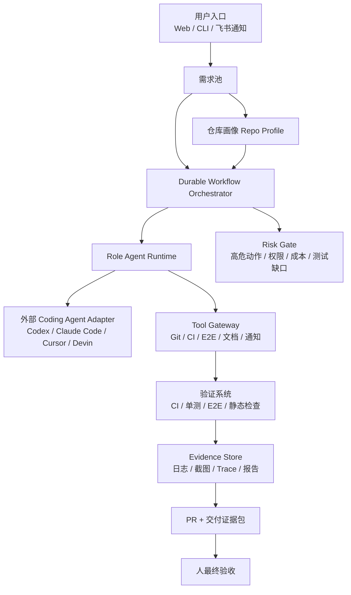
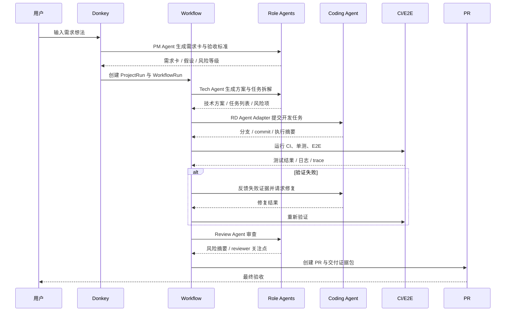

# Donkey MVP 技术方案

## 0. 结论

Donkey MVP 建议采用“确定性流程编排 + 可插拔 Coding Agent + 强证据验收”的技术路线。

核心判断：

- 不自研完整 Coding Agent。MVP 阶段优先接入 Codex、Claude Code、Cursor Cloud Agent、Devin/Factory 等外部 Coding Agent 能力。
- 不把多 Agent 框架作为系统主干。LangGraph、CrewAI、AutoGen、OpenAI Agents SDK 可作为角色 Agent 的实现选项，但 Donkey 的核心资产应是需求、仓库画像、流程状态、风险门禁、证据包和审计。
- 流程主干需要 durable workflow。需求到 PR 是长任务，包含重试、暂停、人工确认、失败恢复和证据采集，不能只靠一次性脚本或纯聊天上下文。
- 自动化边界先到 PR。MVP 不自动合入、不自动上线，避免在测试覆盖不足时扩大事故面。

推荐 MVP 架构：

---

## 1. 目标与边界

### 1.1 MVP 技术目标

Donkey MVP 要支撑 2-3 个相似技术基建仓库，自动完成 B/D 类需求从输入到可验收 PR 的闭环。

阶段口径：Phase 1 先做单仓库闭环，用于压实最小链路；完整 MVP 验收以 Phase 2 为准，即 2-3 个相似仓库均可复用同一套流程并交付到 PR。

关键能力：

| 能力 | MVP 要求 |
|-|-|
| 需求结构化 | 自然语言需求转需求卡、验收标准、关键假设和风险等级 |
| 仓库适配 | 每个试点仓库具备 Repo Profile，记录 SOP、测试命令、CI、E2E、风险边界 |
| 流程编排 | 可持久化、可恢复、可暂停、可重试、可插入人工确认 |
| 任务委派 | PM、Tech、RD、Test、Review 等角色有明确输入输出 |
| 自动开发 | 通过外部 Coding Agent Adapter 在隔离分支/工作区完成代码修改 |
| 自动验证 | 消费 CI、单测、E2E、静态检查结果，生成验收证据 |
| 风险控制 | 高危动作自动拦截，MVP 不自动合入、不自动上线 |
| 交付证据 | PR 附带需求理解、技术摘要、测试结果、风险、未覆盖项和 reviewer 建议 |

### 1.2 非目标

- 不构建通用多租户 Agent 平台。
- 不实现自动上线、自动合入、生产变更自动执行。
- 不自研基础模型或完整 IDE 级代码编辑器。
- 不第一期支持任意技术栈和任意仓库。
- 不以聊天流作为唯一状态来源。

---

## 2. 行业技术调研摘要

完整调研见 `docs/research/mvp-technical-research.md`。这里只保留对技术方案有直接影响的结论。

### 2.1 Agent 编排框架

| 技术 | 资料 | 可用能力 | Donkey 采用建议 |
|-|-|-|-|
| LangGraph | [官方 workflows/agents 文档](https://docs.langchain.com/oss/python/langgraph/workflows-agents) | workflow、agent、持久化、streaming、debugging、deployment | 可用于角色 Agent 或复杂决策流，不建议作为唯一业务状态源 |
| CrewAI | [官方文档](https://docs.crewai.com/) | crews、flows、guardrails、memory、knowledge、observability | 可借鉴角色化与 Flow 设计，MVP 不强绑定 |
| AutoGen | [官方文档](https://microsoft.github.io/autogen/stable/index.html) | 事件驱动多 Agent、确定性与动态 workflow | 可作为多 Agent 协作参考，产品主干仍需自有状态模型 |
| OpenAI Agents SDK | [官方文档](https://openai.github.io/openai-agents-python/) | tools、handoffs、guardrails、sessions、tracing、sandbox agents | 适合 OpenAI-first agent runtime 或专项 Agent，实现时可作为候选 |

判断：Agent 框架已经成熟到能支撑角色协作，但框架通常解决“Agent 怎么协作”，不解决 Donkey 最核心的“需求状态、仓库画像、风险门禁、证据包和验收决策”。因此 MVP 应采用框架可替换的 Agent Runtime，而不是框架锁定的产品架构。

### 2.2 Coding Agent

| 技术 | 资料 | 可用能力 | Donkey 采用建议 |
|-|-|-|-|
| OpenAI Codex | [Codex cloud docs](https://developers.openai.com/codex/cloud) | 后台执行任务、连接 GitHub、创建 PR | 作为 RD Agent Adapter 的优先候选 |
| Claude Code | [Claude Code GitHub Actions](https://code.claude.com/docs/en/github-actions) | 在 issue/PR 中分析代码、创建 PR、实现功能和修复 bug | 适合作为 GitHub 工作流内的代码执行后端 |
| Cursor | [Cursor docs](https://cursor.com/docs) | Agent、Rules、MCP、Skills、CLI、团队能力 | 适合已有 Cursor 使用习惯的团队 |
| Devin | [Devin PR templates](https://docs.devin.ai/integrations/pr-templates) | 独立任务执行与 PR 模板协作 | 适合作为更自动化的外部执行后端 |
| Factory Droids | [Factory Droids](https://factory.ai/product/droids) | 计划、编码、测试、交付代码 | 验证行业趋势：任务级交付正在产品化 |

判断：Donkey 不应在 MVP 阶段复制这些 Coding Agent 的能力，而应提供统一 Adapter，把“需求、上下文、仓库画像、验收标准、风险边界”稳定交给外部执行者，并把执行结果归一成可验收证据。

### 2.3 持久化工作流

| 技术 | 资料 | 优势 | 风险 |
|-|-|-|-|
| Temporal | [Temporal Workflows](https://docs.temporal.io/workflows) | 成熟、长任务可靠、重试/恢复能力强、适合复杂业务流程 | 引入成本较高，需要理解 workflow/activity 约束 |
| Inngest | [Inngest docs](https://www.inngest.com/docs) | 事件驱动、轻量、开发体验好、支持 TS/Python/Go | 对复杂人工审批和企业内部部署需进一步验证 |
| Hatchet | [Hatchet docs](https://docs.hatchet.run/home) | 面向任务和 agent invocation，支持 durable workflow、replay、监控 | 生态成熟度弱于 Temporal |
| Dagger | [Dagger](https://dagger.io/) | 容器化、可编程交付环境、适合可复现 CI | 更偏执行环境，不是完整业务状态编排 |

推荐：MVP 以“Durable Workflow Abstraction”为系统边界，技术落地优先选 Temporal；如果团队更重视轻量自托管和快速集成，可评估 Hatchet 作为替代。不要把一次性任务队列或脚本作为最终架构。

补充取舍：Temporal 是默认推荐，不是不可替代前提。如果团队没有 Temporal 运维基础，建议先围绕同一套 Durable Workflow Abstraction 做 1-2 周短 spike，对比 Temporal 与 Hatchet 在部署、人工确认、重试恢复、事件查询和调试体验上的成本，再定型。

### 2.4 工具协议与互操作

| 技术 | 资料 | 判断 |
|-|-|-|
| MCP | [MCP security best practices](https://modelcontextprotocol.io/docs/tutorials/security/security_best_practices) | 适合作为工具连接标准，但必须配套授权、白名单、审计和安全边界 |
| A2A | [A2A official docs](https://a2a-protocol.org/latest/) | A2A 官方 latest 文档已进入 1.0 版本语境，代表 Agent 间互操作趋势，MVP 保留 Adapter 扩展点即可 |
| ACP | [ACP official docs](https://agentcommunicationprotocol.dev/introduction/welcome) | ACP 已进入 Linux Foundation 相关 Agent 通信生态，并与 A2A 方向收敛；Donkey 不宜把内部对象模型绑定到某个协议 |

判断：MVP 的工具连接层应优先使用 MCP/CLI/API 组合。对稳定内部工具可直接做 Adapter；对通用工具和未来生态接入，优先走 MCP。

### 2.5 安全与治理

| 资料 | 内容 | Donkey 设计影响 |
|-|-|-|
| [OWASP LLM Top 10 2025](https://owasp.org/www-project-top-10-for-large-language-model-applications/assets/PDF/OWASP-Top-10-for-LLMs-v2025.pdf) | LLM 应用存在 prompt injection、敏感信息泄露、供应链等风险 | 仓库内容、文档、需求输入都应视为不可信上下文 |
| [OWASP Agentic AI Threats](https://genai.owasp.org/resource/agentic-ai-threats-and-mitigations/) | Agent 工具使用、自治决策、多 Agent 协作带来新风险 | 高危动作 Gate、工具权限、审计日志是核心能力 |
| [Codex internet access](https://developers.openai.com/codex/cloud/internet-access) | Codex 官方文档将网络访问与 prompt injection、代码/secret 外泄、恶意依赖等风险关联 | 分支隔离不够，执行环境必须限制网络、凭证和工具权限 |
| [NIST GenAI Profile](https://www.nist.gov/publications/artificial-intelligence-risk-management-framework-generative-artificial-intelligence) | 生成式 AI 风险管理框架 | 需要风险识别、度量、治理和反馈闭环 |
| [SLSA](https://slsa.dev/) | 软件供应链完整性框架 | 需要保留执行记录、依赖变更、验证证据和可追溯 PR |

判断：Donkey 的安全设计不能只依赖模型“听话”。必须通过权限隔离、工具策略、执行沙箱、证据记录和人工高危确认来约束自动化。

### 2.6 CI/E2E 与可观测性

| 技术 | 资料 | 可用能力 | Donkey 采用建议 |
|-|-|-|-|
| Playwright | [官方文档](https://playwright.dev/) | 自动等待、断言、trace、并行、多浏览器 E2E | Test Agent 应把 trace、截图、视频和失败日志纳入证据包 |
| GitHub Actions | [GitHub Actions CI](https://docs.github.com/en/actions/get-started/continuous-integration) | 仓库内 CI workflow、PR 检查、构建和测试自动化 | Donkey 不替代 CI，而是消费 CI 结果并转成验收证据 |
| GitLab CI | [GitLab workflow rules](https://docs.gitlab.com/ci/yaml/workflow/) | 分支 pipeline、MR pipeline、workflow rules | 仓库适配层要抽象 GitHub/GitLab 的 PR/MR 与 pipeline 差异 |
| OpenTelemetry | [官方文档](https://opentelemetry.io/docs/) | traces、metrics、logs 的供应商中立标准 | WorkflowRun、AgentRun、ToolRun、Evidence 应能串成可追踪链路 |

判断：CI/E2E 是 Donkey 交付可信度的底座，可观测性是 Donkey 解释失败和复盘优化的底座。MVP 可以不自建完整测试平台和观测平台，但必须把外部验证结果和事件链路结构化存储。

---

## 3. 推荐技术架构

### 3.1 分层架构

| 层级 | 职责 | 推荐技术方向 |
|-|-|-|
| Experience Layer | 需求输入、运行状态、最终验收、高危确认 | Web 控制台 + CLI + 飞书通知 |
| Product State Layer | Demand、Project、WorkflowRun、AgentRun、ToolRun、Evidence、PR 等产品对象 | PostgreSQL + JSONB |
| Durable Workflow Layer | 长任务编排、重试、暂停、恢复、人工确认、失败分支 | Temporal 优先，Hatchet 备选 |
| Agent Runtime Layer | PM/Tech/Test/Review 等角色任务、结构化输出、handoff | 轻量自研 Runtime + 可插拔 LangGraph/OpenAI Agents SDK |
| Coding Agent Adapter Layer | 调用外部 Coding Agent，管理任务输入、状态、结果和 PR | Codex / Claude Code / Cursor / Devin / Factory adapters |
| Tool Gateway Layer | Git、CI、E2E、文档、通知、仓库元数据、测试证据 | Direct adapters + MCP adapters |
| Evidence & Audit Layer | 测试结果、日志、截图、trace、成本、风险、工具调用记录 | Object storage + Postgres + OpenTelemetry |
| Policy & Risk Layer | 风险分类、高危动作拦截、权限、成本和测试缺口判断 | Policy rules + approval gate |

### 3.2 技术栈建议

| 组件 | MVP 推荐 | 说明 |
|-|-|-|
| 控制台 | Web + CLI | Web 用于验收和观察，CLI 用于技术团队快速触发和调试 |
| 服务端 | TypeScript 或 Go | TypeScript 更适合快速接 MCP、前端和 Agent 生态；Go 适合长期稳定服务 |
| 数据库 | PostgreSQL | 强一致产品状态、JSONB 承载 Agent/Tool 结构化结果 |
| 工作流 | Temporal | 长任务、重试、人工确认、失败恢复和审计更稳 |
| 对象存储 | S3 兼容存储或内部文件服务 | 保存日志、截图、E2E trace、报告 |
| Agent Runtime | 可插拔 | 角色 Agent 不绑定某个框架，先要求结构化输入输出 |
| Coding Agent | Adapter 模式 | Codex、Claude Code、Cursor、Devin 等后端可替换 |
| 工具连接 | MCP + Direct Adapter | 通用工具走 MCP，核心内部工具可直连 |
| 可观测性 | OpenTelemetry | 统一 workflow、agent、tool、cost、failure trace |

推荐取舍：MVP 先以 TypeScript + PostgreSQL + Temporal + Adapter 模式推进。理由是 Donkey 核心在产品状态和长任务治理，Temporal 提供可靠流程底座，Adapter 避免被某个 Coding Agent 或 Agent 框架锁死。

---

## 4. 核心产品对象模型

MVP 不需要完整企业级对象体系，但以下对象必须稳定。

| 对象 | 含义 | 关键字段方向 |
|-|-|-|
| Demand | 原始需求 | 标题、描述、来源、目标、非目标、优先级、状态 |
| AcceptanceCriteria | 验收标准 | 条目、判定方式、证据类型、结果 |
| RepoProfile | 仓库画像 | 技术栈、目录结构、SOP、测试命令、CI、E2E、风险规则 |
| ProjectRun | 一次需求执行 | 关联 Demand、目标仓库、风险级别、当前阶段 |
| WorkflowRun | 流程实例 | 模板、节点、状态、重试、人工确认点 |
| TaskRun | 任务实例 | 角色、输入、输出、依赖、状态 |
| AgentRun | Agent 执行记录 | agent 类型、模型/后端、上下文摘要、产物 |
| ToolRun | 工具调用记录 | 工具、参数摘要、权限、结果、耗时、错误 |
| Evidence | 验收证据 | 类型、来源、关联验收标准、日志/截图/trace |
| RiskFinding | 风险项 | 级别、来源、影响、建议处理 |
| PullRequest | 交付入口 | 分支、commit、PR URL、状态、review 结论 |

设计原则：

- 产品对象由 Donkey 持久化，不能只留在 Agent 对话里。
- Agent 输出必须结构化，才能被 Gate、证据包和后续复盘消费。
- Evidence 必须能反向关联到验收标准，否则不能证明交付符合预期。

---

## 5. MVP 主流程

### 5.1 需求进入

输入可以来自 Web、CLI 或飞书消息。MVP 阶段只要求自然语言描述，不要求用户填写完整表单。

系统需要自动产出：

- 目标与背景。
- 范围与非目标。
- 影响仓库候选。
- 验收标准。
- 风险等级。
- 信息缺口。

### 5.2 需求准入与分流 Gate

Donkey 采用“先宽后严”，但“宽”只适用于 MVP 范围内的 B/D 类需求。需求进入后必须先经过准入与分流 Gate，避免把跨系统大改、生产影响类需求或无法验收的需求错误纳入默认自动交付路径。

| 分流结果 | 适用需求 | 系统行为 |
|-|-|-|
| 自动跑到 PR | Bugfix、小优化、研发效能工具功能、技术平台普通增强，影响范围可定位，验收标准可生成 | 直接进入自动方案、开发、验证、PR 流程 |
| 先追问再推进 | 目标明确但缺少关键边界，例如目标仓库不明确、验收条件不完整、权限影响不清楚 | 最多追问 1-3 个关键问题，补齐后继续 |
| 只生成方案 | 跨系统大改、权限模型、数据库迁移、发布链路、生产部署、secret/token、权限相关 CI/CD 变更、任务执行链路重构 | 生成需求卡、影响面、技术方案和操作清单，不自动执行危险动作 |
| 暂不进入 MVP | 从零新产品、强业务创新、强 UI/视觉设计、生产发布、不可逆数据操作、无法定义验收标准 | 明确拒绝自动交付，建议人工拆分或转为方案评审 |

只有当需求在准入 Gate 中被判定为“自动跑到 PR”时，Donkey 才会基于假设继续推进；关键假设必须在交付包中披露。被判定为“先追问再推进”的需求，必须先补齐阻塞信息。

补充：测试 workflow、lint 配置、非发布类 CI 优化可以作为中风险需求进入“自动跑到 PR”，但交付包必须突出风险和 reviewer 关注点；涉及发布、生产部署、secret/token 或权限的 CI/CD 变更不进入自动开发路径。

### 5.3 仓库画像匹配

Repo Profile 是 MVP 成败关键。

每个试点仓库需要沉淀：

- 技术栈与主要目录。
- 本地启动与测试命令。
- CI 与 E2E 入口。
- 代码规范与 review 偏好。
- 业务/平台术语。
- 高危文件、目录和操作。
- 典型需求样例。
- 常见失败与修复建议。

仓库画像应被视为“Agent 工作说明书”，而不是普通文档附件。

最小可用 Repo Profile 的验收条件：

| 条件 | 达标标准 |
|-|-|
| 测试命令 | 至少包含可执行的单测/检查命令，且能在当前仓库环境跑通 |
| CI 入口 | 能定位 PR/MR 触发的 CI 或检查项 |
| E2E 入口 | 若仓库已有 E2E，必须记录触发方式、产物位置和失败排查入口；若没有，必须标记为缺口 |
| 高危边界 | 高危目录、配置、凭证、生产变更和发布相关文件明确 |
| 历史样例 | 至少 3 个历史 B/D 类需求样例，包含需求、改动范围、测试方式和验收方式 |
| 常见失败 | 至少记录 3 类常见失败及排查入口，例如依赖安装、环境变量、测试数据、权限 |

### 5.4 自动开发

RD Agent 不直接等同于某个模型，而是一个 Adapter 体系。

Adapter 对外统一：

- 输入：需求卡、验收标准、技术方案、任务范围、仓库画像、风险边界。
- 执行：创建隔离分支/工作区，调用外部 Coding Agent。
- 输出：commit、diff 摘要、执行日志、失败原因、测试建议。
- 状态：排队、执行中、等待外部、失败、完成、取消。

MVP 先接 1-2 个 Coding Agent 后端即可，但接口要支持多后端并存。

不同 Coding Agent 后端的任务模型、权限模型和证据回传差异较大，Adapter 必须显式定义最小合同，而不能假设它们天然一致。

| Adapter 能力 | MVP 最小合同 | Codex Cloud 典型形态 | Claude Code GitHub Actions 典型形态 | 风险 |
|-|-|-|-|-|
| 任务创建 | 接收结构化需求、仓库、分支、验收标准、风险边界 | 在 Codex cloud environment 中检出仓库并执行任务 | 通过 GitHub issue/PR 或 workflow 触发 | 输入格式不一致导致上下文丢失 |
| 执行环境 | 临时隔离环境，不带生产凭证 | 云端环境和配置命令 | GitHub Actions runner / GitHub App 权限 | 环境权限和网络边界差异 |
| 状态回传 | 排队、执行中、失败、完成、取消 | Codex 任务状态 | Workflow/job 状态和 action 日志 | 状态粒度不一致 |
| 代码结果 | 分支、commit、diff 摘要、PR 链接或可创建 PR 的变更包 | 可创建 PR | 可提交 commit 或创建 PR | PR 创建权限不同 |
| 证据回传 | 执行摘要、测试命令、日志、失败原因、未覆盖项 | 任务日志和命令输出 | Actions 日志、artifact、comment | 日志格式不统一 |
| 取消与超时 | 支持取消、超时、预算上限 | 依赖平台能力 | 依赖 workflow/job 控制 | 失控任务造成成本和资源浪费 |

### 5.5 自动验证

验证不只看“命令是否成功”，而是要服务最终验收。

证据类型：

- CI 结果。
- 单测结果。
- E2E 结果。
- Playwright trace、截图、视频。
- 静态检查结果。
- 关键日志。
- 未覆盖项说明。
- 人工无法自动判定的验收项。

每条验收标准都应有结果：通过、失败、未覆盖、需人工判断。

### 5.6 PR 与交付证据包

PR 描述应成为用户验收入口。

必须包含：

- 需求理解与关键假设。
- 方案摘要。
- 改动摘要。
- 验收标准逐条结果。
- 测试结果。
- 风险与未覆盖项。
- reviewer 关注点。
- 是否建议接受。

Web 验收页可以比 PR 更友好，但 PR 描述必须自洽，因为它是研发流程中的正式交付物。

---

## 6. 风险、安全与权限设计

### 6.1 高危动作分类

| 动作类型 | MVP 策略 |
|-|-|
| 自动合入主干 | 禁止 |
| 自动上线生产 | 禁止 |
| 生产写操作 | 禁止自动执行，只生成方案和操作清单 |
| 删除数据 | 禁止自动执行 |
| 权限扩大 | 必须人工确认 |
| 数据库迁移 | 必须人工确认，且需要回滚说明 |
| 密钥/凭证变更 | 禁止 Agent 直接处理明文密钥 |
| 测试 workflow / lint / 非发布类 CI 优化 | 中风险，可自动到 PR，但必须在交付包突出 |
| 发布链路 / 生产部署 / secret / 权限相关 CI/CD 变更 | 高风险，只生成方案或强人工确认 |

### 6.2 权限模型

MVP 采用最小权限原则：

- Agent 默认只读仓库和文档。
- 代码修改只能发生在隔离分支。
- CI/E2E 只能针对分支或 PR 运行。
- 写操作必须经过 Tool Gateway。
- 高危工具必须有 policy gate。
- 所有 ToolRun 都必须记录参数摘要、调用者、结果和审计 ID。

### 6.3 MVP 最低执行隔离边界

分支/工作区隔离只能控制代码合入风险，不能防止测试脚本、依赖安装、外部网页内容或恶意仓库上下文带来的网络、凭证和供应链风险。MVP 必须设置最低执行边界。

| 边界 | MVP 要求 |
|-|-|
| 执行环境 | 外部 Coding Agent 或自托管执行器必须运行在临时沙箱/容器/隔离 runner 中 |
| 生产凭证 | Agent 阶段不得注入生产凭证、生产数据库连接串或高权限 token |
| Token 权限 | 代码仓库 token 使用最小权限，优先只允许创建分支、提交 PR、读取 CI 状态 |
| Secret 暴露 | setup 阶段需要的凭证不得进入 Agent 可见上下文；日志与证据包必须脱敏 |
| 网络访问 | 默认限制 egress；确需访问包管理器、代码托管、内部测试环境时使用 allowlist |
| 依赖安装 | 依赖安装日志必须保留；新增依赖需在交付包中披露 |
| 工具调用 | 所有写工具通过 Tool Gateway，工具名、参数摘要、结果和调用者可审计 |
| 高危动作 | 生产写操作、删除数据、自动合入、自动上线等禁止在 Agent 执行环境中出现可调用入口 |

### 6.4 成本与预算 Gate

自动化默认跑到 PR，但必须有成本边界，避免长时间循环、外部 Agent 队列堆积和模型调用失控。

| Gate | MVP 建议 |
|-|-|
| 单需求预算 | 每个 ProjectRun 配置最大模型调用成本、外部 Agent 成本或执行时长 |
| 重试上限 | 同一验证失败最多自动修复 2-3 轮，超过后升级为阻塞报告 |
| 外部 Agent 超时 | Coding Agent 执行超过阈值后取消或转人工确认 |
| 并发上限 | 每个仓库限制同时运行的 ProjectRun 数，避免 CI 和 runner 被打满 |
| 高成本节点 | 长 E2E、大规模静态分析、跨仓库扫描等节点需要在交付包记录成本 |
| 人工升级 | 达到预算、重试或超时阈值后，不继续自动消耗资源，输出下一步建议 |

### 6.5 Prompt Injection 与上下文安全

仓库代码、Issue、文档、测试日志、网页内容都可能包含恶意指令。Donkey 应将它们视为数据而非系统指令。

产品约束：

- System instruction 与 repo content 分层。
- Tool allowlist 明确。
- Agent 不能自行扩大工具权限。
- 外部内容引用必须标注来源。
- 高危动作只信任 policy，不信任模型自评。

### 6.6 测试覆盖不足策略

已有项目的 CI/E2E 覆盖不一定完善。Donkey 不能把“现有测试通过”包装成“需求一定正确”。

策略：

- 验收标准逐条判定。
- 无法自动验证的项标记“未覆盖”。
- 交付包突出测试缺口。
- Test Agent 可建议补测试，但不把补测试作为所有需求的阻塞前置。
- 多次出现的测试缺口沉淀进 Repo Profile。

---

## 7. 可观测性与审计

MVP 至少要能回答：

- 这个需求现在卡在哪。
- 哪个 Agent 做了什么。
- 哪个工具被调用过。
- 哪些测试跑过，结果是什么。
- 哪些失败被自动修复了。
- 最终 PR 为什么建议接受或退回。

推荐事件模型：

| 事件 | 说明 |
|-|-|
| DemandCreated | 需求进入 |
| CriteriaGenerated | 验收标准生成 |
| WorkflowStarted | 流程开始 |
| TaskAssigned | 任务委派 |
| AgentRunStarted / Completed / Failed | Agent 执行状态 |
| ToolRunStarted / Completed / Failed | 工具调用状态 |
| GateTriggered | 风险或人工确认触发 |
| EvidenceAttached | 证据挂载 |
| PRCreated | PR 创建 |
| UserAccepted / UserRejected | 用户验收结果 |

可观测性建议使用 OpenTelemetry 思路，将 WorkflowRun、AgentRun、ToolRun 和 Evidence 串联成 trace。MVP 不需要一开始建设完整可观测平台，但事件结构要为后续扩展留好接口。

---

## 8. MVP 里程碑

### Phase 0：技术准备

目标：建立可运行的最小产品骨架和 2-3 个试点仓库画像。

交付：

- Repo Profile 模板。
- 风险动作清单。
- PR 交付证据包模板。
- 外部 Coding Agent Adapter 选型。
- CI/E2E 结果采集方式。

退出标准：

- 至少 2 个 Repo Profile 达到最小可用标准。
- 完成 Temporal/Hatchet 或同类 durable workflow spike，并确认 MVP 技术路线。
- 至少 1 个 Coding Agent Adapter 能在试点仓库创建隔离分支或 PR。
- PR 交付证据包模板通过 3 个历史需求 replay 检查。

### Phase 1：单仓库闭环

目标：在一个仓库跑通需求到 PR 的完整链路。

交付：

- 需求卡与验收标准生成。
- 技术方案与任务拆解。
- 调用 Coding Agent 完成开发。
- 自动运行验证。
- 创建 PR 与证据包。
- 高危动作拦截。

退出标准：

- 至少 3 个真实 B/D 类需求在单仓库跑到 PR。
- 高危动作误执行为 0。
- 每个 PR 都有验收标准逐条结果和未覆盖项说明。
- 失败需求能输出阻塞原因和下一步建议，而不是只给出执行失败。

### Phase 2：2-3 个相似仓库复用

目标：验证 Donkey 不是单仓库脚本。

交付：

- 多 Repo Profile。
- 仓库选择和影响面判断。
- Workflow 复用与差异化规则。
- 跨仓库指标对比。

退出标准：

- 至少 10 个真实 B/D 类需求进入试点。
- 2-3 个仓库均有成功跑到 PR 的样例。
- 无中途人工介入到 PR 的比例达到 50%+。
- 交付周期较同类人工流程中位数下降 30%+。

### Phase 3：自修复与证据质量增强

目标：提升自动化闭环率和验收效率。

交付：

- CI/E2E 失败自动分类。
- 自动修复循环。
- 测试缺口沉淀。
- 交付证据包质量评分。

退出标准：

- 验收标准可判定率达到 90%+。
- PR 一次审查通过率达到 60%+。
- 80%+ 的最终验收能在 5 分钟内完成接受或退回判断。
- 自动修复超过重试上限时能稳定升级为阻塞报告。

---

## 9. 关键技术决策

| 决策 | 推荐 | 原因 |
|-|-|-|
| 主干编排 | Durable Workflow，优先 Temporal | 长任务、暂停、重试、恢复和人工确认是核心复杂度 |
| Coding Agent | Adapter 接外部 Agent | 行业已有成熟代码执行者，Donkey 不应重复造轮子 |
| Agent 框架 | 可插拔，不锁定 | 保留 LangGraph、OpenAI Agents SDK、CrewAI、AutoGen 的使用空间 |
| 数据状态 | PostgreSQL 持久化产品对象 | 不能依赖聊天上下文保存业务状态 |
| 工具连接 | MCP + Direct Adapter | 通用工具走 MCP，核心内部系统直连更可靠 |
| 执行隔离 | 临时沙箱/容器/隔离 runner + 分支隔离；生产凭证禁入；网络 allowlist；写工具经 Tool Gateway | 降低代码修改、工具调用、网络访问、secret 外泄和恶意依赖风险 |
| 自动化边界 | 到 PR 为止 | 兼顾自动化体验和生产安全 |
| 验收方式 | 证据包驱动 | 让用户只关注交付结果和风险项 |
| 成本控制 | 预算 Gate + 重试/超时上限 | 防止长任务、外部 Agent 和模型调用失控 |

---

## 10. 技术风险与缓解

| 风险 | 影响 | 缓解 |
|-|-|-|
| Agent 输出不稳定 | PR 质量波动 | 结构化输入输出、证据包、review agent、真实指标追踪 |
| CI/E2E 覆盖不足 | 假阳性交付 | 验收标准逐条判定，未覆盖项显式披露 |
| 外部 Coding Agent 被锁定 | 供应商依赖 | Adapter 设计，至少支持两类后端 |
| 长任务失败恢复复杂 | 用户体验差 | Durable workflow、事件日志、重试和恢复 |
| Prompt injection | 工具越权或错误执行 | 上下文分层、工具白名单、policy gate |
| 成本不可控 | 难以规模化 | 单需求预算、重试上限、外部 Agent 超时、并发上限和人工升级 |
| 风险策略太宽 | 自动化事故 | MVP 禁止合入/上线，高危动作必须人工确认 |
| 风险策略太严 | 效率收益不足 | 默认自动跑到 PR，只拦截高危动作 |

---

## 11. MVP 成功标准

| 指标 | 目标 |
|-|-|
| 真实需求数量 | 10 个以上 B/D 类需求 |
| 仓库范围 | 2-3 个相似技术基建仓库 |
| 自动闭环率 | 50%+ 需求无中途人工介入跑到 PR |
| 交付周期 | 较同类人工流程中位数下降 30%+ |
| 验收标准可判定率 | 90%+ |
| PR 一次审查通过率 | 60%+ |
| 高危动作误执行 | 0 |
| 自动合入/自动上线 | 0 |
| 最终验收决策效率 | 80%+ 用户能在 5 分钟内判断接受或退回 |

---

## 12. 推荐下一步

1. 选定 2-3 个试点仓库。
2. 为每个仓库建立 Repo Profile。
3. 选定第一批 Coding Agent Adapter：建议 Codex + Claude Code 二选一或并行验证。
4. 选定 durable workflow 方案：建议 Temporal 优先。
5. 设计交付证据包模板和 PR 模板。
6. 用 3 个历史需求做离线 replay，验证需求卡、任务拆解和证据包是否足够。
7. 用 10 个真实需求进入 MVP 试点。
